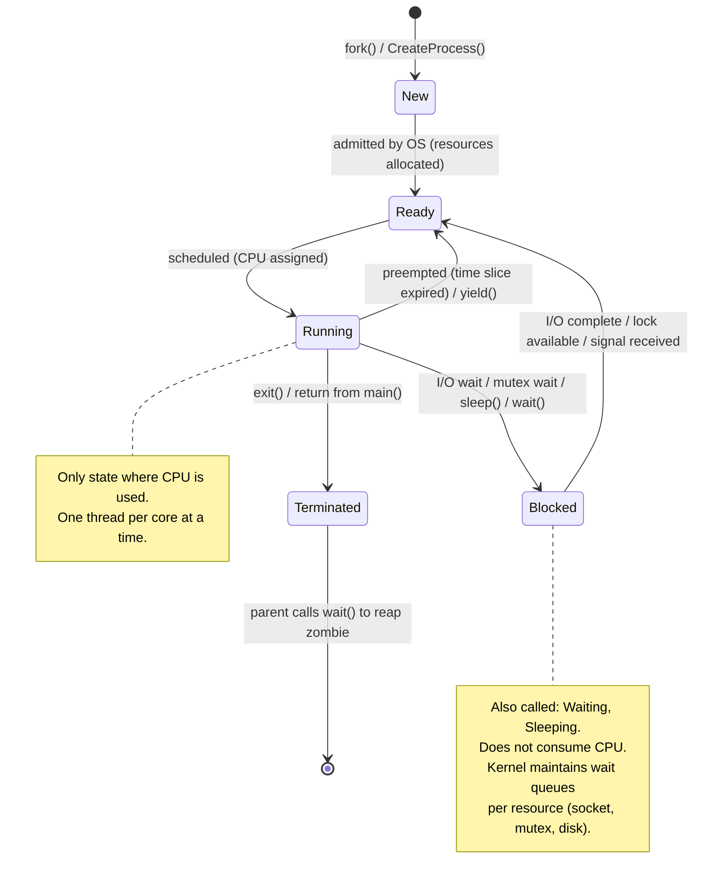

# Operating Systems

Foundational OS concepts for backend engineers. Knowing this layer explains why distributed systems behave the way they do, why concurrency is hard, and what costs are hidden inside "just spawn a thread."

---

## Table of Contents

1. [Process vs Thread vs Coroutine](#1-process-vs-thread-vs-coroutine)
2. [Address Space Layout](#2-address-space-layout)
3. [Virtual Memory](#3-virtual-memory)
4. [Context Switching](#4-context-switching)
5. [Process States](#5-process-states)
6. [Schedulers](#6-schedulers)
7. [IPC Mechanisms](#7-ipc-mechanisms)
8. [System Calls and the User/Kernel Boundary](#8-system-calls-and-the-userkernel-boundary)
9. [fork, copy-on-write, and exec](#9-fork-copy-on-write-and-exec)
10. [Memory Protection and OS Isolation](#10-memory-protection-and-os-isolation)
11. [Interview Questions](#11-interview-questions)

---

## 1. Process vs Thread vs Coroutine

These are three different answers to the question: "how do I run multiple things concurrently?"

### Process

A process is an instance of a running program. It is the OS's fundamental unit of isolation.

- **Own virtual address space** — no other process can read its memory without explicit IPC
- **Own file descriptor table, signal handlers, resource limits**
- **Own page tables** — the kernel maps virtual addresses to physical pages per-process
- **Created by `fork()`** — clones the parent's address space (copy-on-write)
- **Creation cost**: ~1 ms (page table setup, file descriptor duplication, kernel bookkeeping)
- **Communication**: explicit IPC (pipes, sockets, shared memory, signals)

### Thread

A thread is a unit of execution within a process. Threads within the same process share the same address space.

- **Shared**: heap, globals, file descriptors, code segment
- **Private**: stack, registers, thread-local storage, signal mask, errno
- **Created by `pthread_create()` (Linux) or `CreateThread()` (Windows)**
- **Creation cost**: ~10–100 µs (allocate stack, initialize TCB, one kernel call)
- **Communication**: direct memory reads/writes — which is why races are easy to introduce
- **Context switch cost**: cheaper than process switch because no address space flush (TLB retained for same process)

### Coroutine (Green Thread / Fiber)

A coroutine is a unit of execution scheduled entirely in user space.

- **No kernel involvement in scheduling** — the runtime manages a run queue
- **Cooperative by default** — must explicitly yield (though async runtimes add implicit yield points at I/O)
- **Extremely cheap to create**: typically just allocating a small stack (2–8 KB in Go, vs 1–8 MB for OS threads)
- **Context switch cost**: ~100 ns — only saves/restores a handful of registers, no syscall
- **Examples**: Go goroutines, Python asyncio coroutines, Rust async tasks, Erlang processes

| Property | Process | Thread | Coroutine |
|---|---|---|---|
| Memory space | Isolated | Shared (with siblings) | Shared (with runtime) |
| Scheduling | Kernel | Kernel | User space runtime |
| Creation cost | ~1 ms | ~10–100 µs | ~1 µs |
| Switch cost | ~5–10 µs | ~1–5 µs | ~100 ns |
| Stack size | 1–8 MB | 1–8 MB | 2–64 KB (growable) |
| Crash isolation | Full | None (kills process) | None (panics propagate) |
| Communication | IPC | Shared memory | Shared memory |

**When to use what:**
- Use **processes** when you need fault isolation (a crashed worker should not crash the parent) or when you need separate privilege levels
- Use **threads** when the work is CPU-bound and you need to share large in-memory data structures cheaply
- Use **coroutines/async** when the work is I/O-bound — you can run 100k goroutines where 100k threads would exhaust memory

---

## 2. Address Space Layout

Every process sees a private virtual address space, laid out in a standard pattern by the OS loader.

```
High addresses (0xFFFFFFFFFFFFFFFF on 64-bit)
┌──────────────────────────────────────┐
│          kernel space                │  ← not accessible from user mode
│   (mapped into every process but     │
│    protected by ring/privilege bits) │
├──────────────────────────────────────┤
│          stack                       │  ← grows downward ↓
│  (local variables, return addresses, │
│   saved registers, function frames)  │
│                                      │
│   [stack grows into unmapped gap]    │
│                                      │
│          memory-mapped region        │  ← mmap() calls land here
│  (shared libraries, file mappings,   │     grows upward ↑
│   anonymous shared memory)           │
│                                      │
│          heap                        │  ← grows upward ↑
│  (malloc/new allocations)            │     managed by brk()/mmap()
├──────────────────────────────────────┤
│          BSS segment                 │  ← uninitialized globals
│  (zero-initialized at load time)     │     e.g.: static int counter;
├──────────────────────────────────────┤
│          data segment                │  ← initialized globals + statics
│  (e.g.: static int x = 42;)         │     backed by the binary on disk
├──────────────────────────────────────┤
│          text segment                │  ← read-only, executable
│  (compiled machine instructions)     │     shared between processes
│  (read-only to prevent self-         │     running the same binary
│   modification)                      │
└──────────────────────────────────────┘
Low addresses (0x0000000000000000)
```

### Segment details

**Text (code) segment**
Read-only, executable. Marked non-writable to prevent code injection. When two processes run the same binary, the kernel maps the *same physical pages* for the text segment into both virtual address spaces — saves physical memory.

**Data segment**
Contains initialized global and static variables. Backed by the binary file. If a global is `int x = 42`, the value `42` is literally embedded in the ELF file's `.data` section and copied into physical memory at load.

**BSS (Block Started by Symbol)**
Zero-initialized globals and statics. Not stored in the binary (no point storing zeros). The OS guarantees these pages are zeroed before the program runs.

**Heap**
Managed by the C runtime via `brk()`/`sbrk()` (extend the heap break) or `mmap()` for large allocations. `malloc()` calls these syscalls to get pages from the kernel, then subdivides and tracks free blocks internally. The kernel does not manage individual `malloc()` allocations — that bookkeeping lives in the heap itself.

**Stack**
Each thread gets its own stack. Fixed at thread creation (default 8 MB on Linux). The OS places a guard page at the bottom (non-readable/writable) so a stack overflow faults immediately rather than silently corrupting the heap. Stack frames are created/destroyed in LIFO order as functions call and return.

**Memory-mapped region**
`mmap()` is how everything interesting happens: loading shared libraries (`.so`/`.dylib`), file I/O that bypasses read/write syscalls, shared memory between processes, anonymous private memory for large allocations.

---

## 3. Virtual Memory

### Why it exists

Without virtual memory, every program would have to coordinate which physical RAM addresses it uses — impossible in a multi-process OS. Virtual memory gives each process the illusion that it owns all of memory, while the kernel and hardware silently translate addresses.

Three problems it solves:
1. **Isolation** — process A can't read process B's memory even if they share the same physical DRAM
2. **Overcommit** — processes can allocate more virtual memory than physical RAM exists (unused pages stay on disk)
3. **Sharing** — multiple processes can map the same physical pages (text segments, shared libraries, shared memory)

### Page table

The CPU's memory management unit (MMU) translates every virtual address to a physical address using a data structure called the page table. On x86-64, this is a 4-level tree (PML4 → PDPT → PD → PT), with each level indexed by 9 bits of the virtual address. The final level maps a 4 KB page frame.

```
Virtual address: [47:39] [38:30] [29:21] [20:12] [11:0]
                  PML4    PDPT    PD      PT     offset
                  index   index   index   index
```

Each page table entry (PTE) stores:
- Physical frame number (PFN)
- Present bit (is the page in RAM right now?)
- Writable bit
- User/supervisor bit (can user-mode code access this?)
- Accessed/dirty bits (for replacement policy)
- NX (no-execute) bit

### TLB (Translation Lookaside Buffer)

Walking four levels of page table for every memory access would be catastrophically slow. The TLB is a hardware cache of recent virtual→physical translations, typically 64–1024 entries. On a TLB hit, translation is ~1 cycle. On a TLB miss, the MMU walks the page table (~100 cycles). On a context switch, the TLB is usually flushed (or tagged with an address space ID, ASID, to avoid flushing) — this is part of why context switches have a warm-up cost.

### Page fault handling

When you access a virtual address whose PTE has the "present" bit cleared, the CPU raises a **page fault** exception. The kernel's fault handler runs:

1. **Is the address in a valid VMA (virtual memory area)?** If not → `SIGSEGV`
2. **What kind of fault is it?**
   - Page not yet allocated (anonymous mapping): allocate a physical frame, zero it, update PTE, return
   - Page on disk (swapped out): read from swap, update PTE, return
   - Write to a copy-on-write page: allocate new frame, copy content, update PTE to point to new frame, mark writable

Page faults are expensive (~1–10 µs) because they involve a privilege switch to kernel mode, potentially disk I/O, and TLB invalidation. This is why `mlock()` exists — it pins pages in RAM and prevents them from being swapped, eliminating fault latency for latency-critical code.

---

## 4. Context Switching

A context switch is the CPU stopping execution of one thread and resuming another. It is the mechanism that enables concurrency on a single core and is the hidden tax of threads.

### What gets saved and restored

The kernel saves the CPU state of the outgoing thread into its **kernel stack** (in the thread's `task_struct`):

**General purpose registers**: `rax`, `rbx`, `rcx`, `rdx`, `rsi`, `rdi`, `rbp`, `rsp`, `r8`–`r15` (16 registers × 8 bytes = 128 bytes)

**Instruction pointer** (`rip`): where to resume

**Stack pointer** (`rsp`): points to the current stack frame

**Flags register** (`rflags`): condition codes from the last arithmetic instruction

**Floating-point/SIMD state** (`XMM`/`YMM`/`ZMM` registers): 512 bytes–2 KB depending on whether AVX-512 is in use — saved lazily (only on first FP use after switch)

**Kernel-mode state** for a process switch (not just thread switch):
- **CR3 register**: pointer to the process's PML4 page table — loading a new CR3 flushes the TLB
- **Segment registers** and GS base (used for thread-local storage)

### Why ~1–10 µs?

The cost is not just the register save/restore (~100 ns). The real costs:

1. **TLB flush**: on a process switch (different address space), CR3 is reloaded, invalidating all cached translations. The next ~100–1000 memory accesses each pay the full 4-level page walk cost.
2. **CPU cache warming**: the new thread's working set may not be in L1/L2/L3. First accesses pay cache miss penalties.
3. **Branch predictor state**: the CPU's branch predictor is now wrong for the new code path.
4. **Pipeline stall**: entering the kernel, saving state, and exiting takes hundreds of cycles even before cache effects.

Thread switches within the same process skip the CR3 reload (TLB retained) and are therefore cheaper (~1–2 µs vs ~5–10 µs for a full process switch).

This is why Go's goroutine scheduler can run millions of goroutines with low overhead: goroutine switches are cooperative user-space switches that save ~100 bytes of state and do not involve the kernel.

---

## 5. Process States

A process is always in exactly one state. The kernel's scheduler acts on ready processes only.



### Zombie state

When a process calls `exit()`, it transitions to **Terminated** but its entry in the process table survives until the parent calls `wait()` or `waitpid()`. This allows the parent to retrieve the exit status. A process in this transitional state is called a **zombie**. It holds no resources (memory freed, file descriptors closed) — only a PID and exit code. If the parent never calls `wait()`, zombies accumulate. If the parent dies, init (PID 1) inherits and reaps them.

### Blocked vs sleeping

"Blocked" and "sleeping" are often used interchangeably. The distinction:
- **Blocked**: waiting on a specific event (I/O, lock, signal)
- **Sleeping**: waiting for a time-based wakeup (`sleep()`, `nanosleep()`)

Both states remove the thread from the run queue and do not consume CPU.

---

## 6. Schedulers

### Preemptive round-robin

The simplest scheduler. Maintains a single queue of ready processes. Assigns each process a **time quantum** (typically 10–100 ms). When the quantum expires, the running process is preempted (forced back to the ready queue) and the next process runs. Ensures fairness but does not account for priority or interactive responsiveness.

### CFS — Completely Fair Scheduler (Linux ≥ 2.6.23)

CFS is the default Linux process scheduler. Its goal: give every process an equal share of CPU time proportional to its weight (nice value).

**Key data structure**: a red-black tree keyed by `vruntime` (virtual runtime — the amount of CPU time the process has consumed, weighted by priority). The process with the smallest `vruntime` is always at the leftmost leaf and is the next to run.

**How it works**:
1. When a process runs, its `vruntime` increases proportional to the CPU time it consumes (adjusted by its weight — lower nice value → slower vruntime growth → more CPU time)
2. When preempted, the process is inserted into the RB-tree at its current `vruntime`
3. The scheduler always picks the leftmost node (smallest `vruntime`) — the most "unfairly treated" process
4. The target scheduling latency is ~6 ms (by default) — within this window, every runnable process gets at least one run

**Why better than round-robin**: CFS naturally adapts to different workloads. A batch process that runs for 100 ms and then sleeps accumulates vruntime and gets deprioritized relative to an interactive process that wakes up frequently after short sleeps. The interactive process stays near the front of the RB-tree.

**Multicore CFS**: each CPU core has its own run queue. A load balancer periodically (every few ms) migrates tasks between cores to equalize queue lengths.

---

## 7. IPC Mechanisms

### Anonymous Pipes

Created by `pipe(int fds[2])`. Unidirectional, in-kernel ring buffer (default 64 KB on Linux). `fds[0]` is the read end, `fds[1]` is the write end.

```c
int fds[2];
pipe(fds);
if (fork() == 0) {
    close(fds[0]);                        // child writes
    write(fds[1], "hello", 5);
} else {
    close(fds[1]);                        // parent reads
    char buf[5];
    read(fds[0], buf, 5);
}
```

**Tradeoffs**: simple, zero setup, automatic EOF when write end closes. **Limitations**: only between related processes (parent/child), unidirectional, no addressing, no persistence.

### Named Pipes (FIFOs)

Created by `mkfifo("/tmp/mypipe", 0666)`. Appears as a file in the filesystem. Any process with permission can open it by path. Still a kernel buffer — data is not written to disk.

**Tradeoffs**: allows unrelated processes to communicate. **Limitations**: still unidirectional, one writer/reader model, no persistence across reboots.

### Message Queues (POSIX)

`mq_open()`, `mq_send()`, `mq_receive()`. The kernel maintains a priority queue of messages. Each message has a type/priority. Receiver can select by type.

**Tradeoffs**: structured messages (not a raw byte stream), can receive by priority, messages persist until explicitly removed even if all processes close the queue. **Limitations**: size limits per message and per queue, not suitable for high-throughput streaming.

### Shared Memory with mmap

The fastest IPC mechanism — no kernel involvement on the data path after setup. Two processes map the same physical pages into their address spaces.

```c
// Process A — creates and writes
int fd = shm_open("/myshm", O_CREAT | O_RDWR, 0666);
ftruncate(fd, sizeof(SharedData));
SharedData *data = mmap(NULL, sizeof(SharedData),
                        PROT_READ | PROT_WRITE, MAP_SHARED, fd, 0);
data->counter = 42;

// Process B — opens and reads
int fd = shm_open("/myshm", O_RDWR, 0666);
SharedData *data = mmap(NULL, sizeof(SharedData),
                        PROT_READ | PROT_WRITE, MAP_SHARED, fd, 0);
printf("%d\n", data->counter);  // 42
```

**Tradeoffs**: zero-copy, bandwidth limited only by RAM and cache. **Critical limitation**: no synchronization — you must add a mutex, semaphore, or atomic to coordinate access, or you have a race condition.

### Signals

Asynchronous notifications sent to a process. `kill(pid, SIGTERM)` from one process, `SIGSEGV` from the kernel. The receiving process's signal handler runs asynchronously (interrupting whatever was executing).

**Tradeoffs**: lightweight, can wake a sleeping process. **Severe limitations**: only ~30 distinct signal numbers, no data payload, handlers have extreme restrictions (only async-signal-safe functions allowed — `write()` yes, `malloc()` no), signals can be lost if the same signal fires twice before being handled.

Use signals for lifecycle events (SIGTERM for shutdown, SIGHUP for reload config), not for data transfer.

### Unix Domain Sockets

Full-duplex, bidirectional, stream or datagram. Same API as TCP/UDP sockets but with `AF_UNIX` address family and a filesystem path instead of IP:port.

```c
// No network stack — kernel copies data between process buffers
struct sockaddr_un addr = { .sun_family = AF_UNIX };
strncpy(addr.sun_path, "/tmp/mysock.sock", sizeof(addr.sun_path));
```

**Tradeoffs**: bidirectional, multiple concurrent connections, can pass file descriptors between processes (`SCM_RIGHTS`), works between unrelated processes, can authenticate peer via `SO_PEERCRED`. Throughput ~5–10 GB/s (kernel copy overhead). **Limitations**: same machine only.

### IPC Mechanism Comparison

| Mechanism | Direction | Related procs only | Zero-copy | Throughput | Use case |
|---|---|---|---|---|---|
| Pipe | Unidirectional | Yes | No | ~10 GB/s | Shell pipelines, parent↔child |
| FIFO | Unidirectional | No | No | ~10 GB/s | Simple producer/consumer |
| Message queue | Bidirectional | No | No | ~1 GB/s | Structured messages, priority |
| Shared memory | Both | No | **Yes** | RAM speed | High-throughput, low-latency |
| Signal | Async | No | N/A | ~0 | Lifecycle events only |
| Unix socket | Bidirectional | No | No | ~5 GB/s | General-purpose, credentials |

---

## 8. System Calls and the User/Kernel Boundary

### The two CPU privilege levels

Modern CPUs run code in (at least) two privilege levels, called **rings** on x86 (Ring 0 = kernel, Ring 3 = user):

- **Ring 3 (user mode)**: cannot directly access hardware, cannot execute privileged instructions (`hlt`, `in`/`out` for I/O ports), cannot modify page tables, cannot disable interrupts
- **Ring 0 (kernel mode)**: unrestricted hardware access, can modify any page table, can execute any instruction

This hardware enforcement is what makes process isolation real — a user-mode process cannot overwrite another process's memory because it cannot change the page tables that define its own address space.

### Mode switch cost

A system call transitions from Ring 3 to Ring 0. On x86-64, this uses the `syscall` instruction (modern CPUs) or `int 0x80` (legacy). The CPU:

1. Saves `rip`, `rsp`, `rflags` to the TSS (task state segment)
2. Switches to the kernel stack
3. Jumps to the syscall entry point
4. Kernel validates arguments (user pointers are untrusted), executes, copies results to user memory
5. Returns via `sysret`, restoring user state

**Cost**: ~100–400 ns for a simple syscall (e.g., `getpid()`). For a syscall that blocks (e.g., `read()` on a socket), the cost includes a context switch if data is not available.

Mitigations: `vDSO` (virtual dynamic shared object) — the kernel maps a small read-only page into every process's address space containing implementations of time-based syscalls (`clock_gettime`, `gettimeofday`). These execute in user space with no mode switch.

### The cost is often overstated

`read()` on a file cached in the page cache: ~1 µs. The bottleneck is not the mode switch — it is cache pressure, lock contention in the VFS layer, and copying data between kernel and user buffers. For hot paths, `io_uring` (Linux 5.1+) allows submitting and completing I/O without any syscall per operation by using shared memory ring buffers between user and kernel space.

---

## 9. fork, copy-on-write, and exec

### fork()

`fork()` creates an exact copy of the calling process. The child inherits:
- All virtual memory mappings
- All open file descriptors
- Signal handlers
- Environment variables
- Current working directory

After `fork()`, both parent and child return from `fork()` (parent gets child PID, child gets 0).

**Why fork() is fast despite copying gigabytes of address space**: copy-on-write (COW). `fork()` does not copy any physical memory pages. Instead:
1. The child gets a new page table that points to the **same physical pages** as the parent
2. Every shared page is marked **read-only** in both parent's and child's page tables
3. When either process writes to a page, the MMU raises a protection fault
4. The kernel handler allocates a new physical page, copies the content, updates the faulting process's PTE to point to the new page and marks it writable
5. The other process's PTE still points to the original page

Result: `fork()` itself is O(address space metadata) — typically microseconds. Physical pages are only copied if and when written. A child that immediately calls `exec()` (the fork-exec pattern) may copy zero data pages.

### What triggers the actual copy

Any write to a page that is shared. The first write to a global variable, the first `malloc()` (which writes heap metadata), modifying the stack — all trigger COW faults. If the child is doing heavy computation over a large heap, it will eventually fault in copies of most pages.

### vfork()

`vfork()` is an optimization for the fork-exec pattern. The child **shares the parent's address space** entirely (no page table copy, no COW setup). The parent is suspended until the child calls `exec()` or `_exit()`. The child must not write to any variable or call any function that would corrupt the parent's stack. `vfork()` is dangerous and mostly obsolete — `posix_spawn()` is the modern alternative.

### exec()

`exec()` (family: `execv`, `execvp`, `execve`, etc.) **replaces** the current process image with a new program. It does not create a new process — the PID stays the same. It:
1. Opens the new binary
2. Reads the ELF headers to find the required memory layout
3. Maps the text segment from the binary, sets up BSS/data/stack
4. Resets signal handlers to defaults, closes `O_CLOEXEC` file descriptors
5. Jumps to the entry point

After `exec()`, the original program's code is gone. This is how shells execute commands: `fork()` to create a child, `exec()` in the child to replace it with `/bin/ls` (or whatever), `wait()` in the parent to collect the exit status.

---

## 10. Memory Protection and OS Isolation

### Why isolation matters

Without memory isolation, any bug in any program can corrupt any other program's state. A buffer overflow in a web server would overwrite the bank transaction in memory next door. OS-level isolation is the foundation of multi-tenant systems.

### Mechanisms

**Page table per process** (enforced by CR3): process A's virtual addresses have no mapping to process B's physical pages. There is no mechanism by which process A can manufacture a valid virtual address that reaches B's memory without kernel assistance.

**Supervisor bit on PTEs**: kernel pages are marked "supervisor only." User-mode code that accesses a kernel virtual address triggers a fault. This prevents a process from reading the kernel's own memory — which might contain passwords, key material, or other processes' data.

**NX (No-Execute) bit**: pages marked NX will fault if the CPU tries to fetch instructions from them. This prevents code injection attacks: if you overflow a buffer and put shellcode in the heap, you cannot execute it because heap pages are NX. Combined with ASLR, this raises the bar significantly.

**ASLR (Address Space Layout Randomization)**: the OS randomizes the base addresses of stack, heap, and loaded libraries at process startup. Exploits that rely on jumping to a known address (return-to-libc) fail because the attacker cannot know the address.

**Seccomp (Secure Computing Mode)**: lets a process declare which syscalls it will use. Any other syscall attempt results in immediate SIGKILL. Used by browsers (each tab is a sandboxed process with minimal syscall rights), Docker containers, and systemd services. Reduces the kernel attack surface even if the process is compromised.

**Namespaces and cgroups**: the basis of containers. Namespaces restrict what the process can see (PID, network, filesystem, user namespaces). Cgroups restrict resource consumption (CPU, memory, I/O). Together they create the illusion of a private machine without the overhead of a hypervisor.

---

## 11. Interview Questions

### Why is context switching expensive?

A context switch has layered costs. The raw register save/restore (~100 ns) is the least of it. The dominant costs are:

1. **TLB flush** (on process switch): CR3 reload invalidates all cached virtual→physical translations. The new process's first ~100–1000 memory accesses each walk the 4-level page table (~100 cycles/walk vs ~1 cycle/TLB hit).
2. **CPU cache pollution**: the new thread's working set displaces the old thread's cached data from L1/L2/L3. L3 misses cost ~100 ns each. Rebuilding the cache takes hundreds of accesses.
3. **Branch predictor invalidation**: the predictor's history is now wrong for the new code path.

For a thread switch within the same process (shared address space), cost is ~1–2 µs. For a process switch, ~5–10 µs. This is why I/O multiplexing with `epoll` + a thread pool beats spawning one thread per connection at scale: fewer context switches, better cache utilization.

---

### What is the difference between fork() and vfork()?

`fork()` sets up copy-on-write page tables so both parent and child can execute independently immediately after the call. The parent continues running in parallel with the child. Safe for any use case. Cost: page table duplication + kernel bookkeeping (~1 ms for large address spaces, mostly for page table entries, not for copying physical pages).

`vfork()` makes the child share the parent's address space **without COW**. The parent is suspended until the child calls `exec()` or `_exit()`. The child must not write to any variable, must not return from the function that called `vfork()` (corrupts parent's stack frame), and must not call any library function that touches global state. Faster for the fork-exec pattern because there is zero address space setup cost. But it is so dangerous to use correctly that `posix_spawn()` is preferred in modern code.

---

### How does copy-on-write work after fork()?

After `fork()`:
1. The kernel creates a new page table for the child but fills it with entries pointing to the **same physical frames** as the parent.
2. Both page tables mark every shared page as **read-only**, even pages the parent previously had write access to.
3. Both processes run normally until one tries to write to a shared page.
4. The write triggers a hardware protection fault (the page is marked read-only).
5. The kernel's fault handler checks: is this a COW page? Yes — allocate a new physical frame, copy the 4 KB page content into it, update the faulting process's PTE to point to the new frame and mark it writable. Resume the faulting instruction.
6. The other process still sees the original page via its unchanged PTE.

The practical result: `fork()` followed immediately by `exec()` copies zero data pages (exec replaces the address space before any write triggers COW). `fork()` followed by computation gradually copies pages on demand as writes occur.

---

### Related topics

- [Concurrency](../concurrency/README.md) — race conditions, mutexes, and memory ordering build directly on the process/thread model covered here
- [Networking foundations](../networking/README.md) — sockets, TCP, and how the kernel's network stack relates to process scheduling
- [Linux CLI](../linux/README.md) — `ps`, `top`, `strace`, `perf` — tools for observing the OS concepts above at runtime
