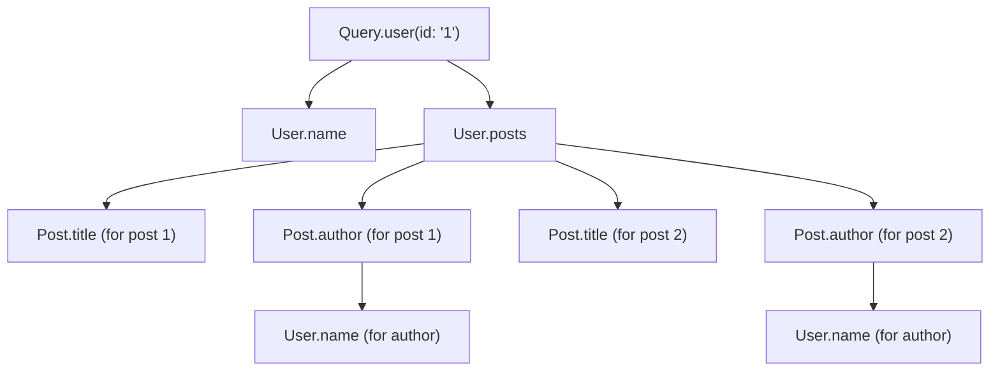
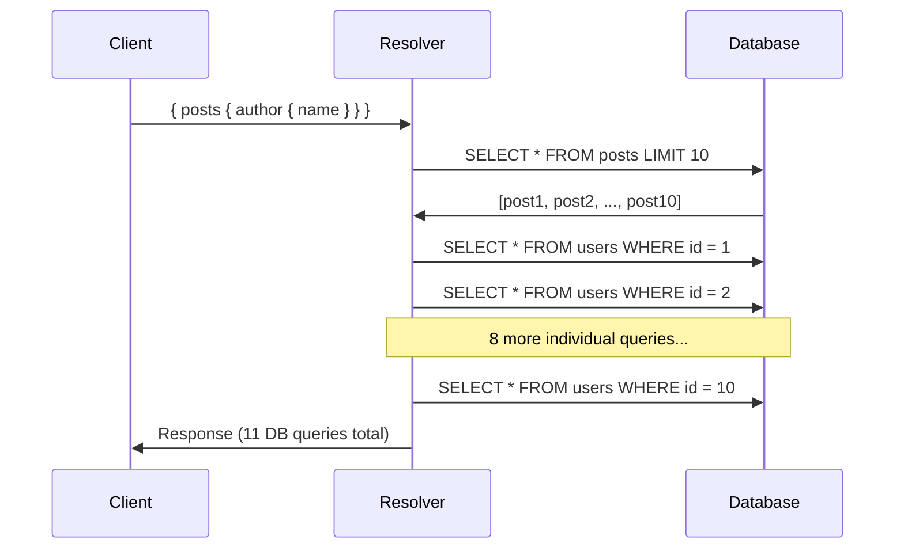
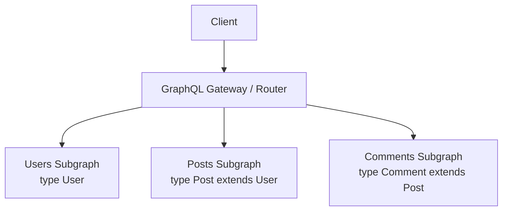

# GraphQL

**Related:** [REST](../rest/README.md) | [HTTP](../http/README.md) | [WebSockets](../websockets/README.md)

---

## What GraphQL Solves

REST APIs have two persistent problems:

- **Over-fetching:** You need a user's name for a display label but the endpoint returns the full user object — profile picture, address, preferences, metadata.
- **Under-fetching:** Rendering a feed requires posts + each post's author + each author's avatar. That is three round trips, or a bespoke endpoint someone has to maintain.

GraphQL lets the client declare exactly what data it needs in a single request and get exactly that back — nothing more, nothing less.

```
REST                              GraphQL
──────────────────────────────    ──────────────────────────────────────────
GET /users/1                      POST /graphql
GET /users/1/posts                { user(id: "1") {
GET /posts/5/comments               name
                                    posts {
3 round trips                         title
Full objects returned                 comments { body author { name } }
                                    }
                                  } }
                                  1 round trip, exact fields
```

---

## Schema Definition Language (SDL)

The schema is the contract between client and server. Every GraphQL API starts here.

```graphql
# Scalar types: String, Int, Float, Boolean, ID (built-in)
# ! means non-null

type User {
  id: ID!
  email: String!
  name: String!
  role: UserRole!
  posts: [Post!]!
  createdAt: String!
}

type Post {
  id: ID!
  title: String!
  body: String!
  author: User!
  tags: [String!]!
  publishedAt: String
}

# Enum
enum UserRole {
  ADMIN
  MEMBER
  VIEWER
}

# Interface — multiple types share these fields
interface Node {
  id: ID!
}

# Union — resolver returns one of several types
union SearchResult = User | Post

# Input type — for mutations (plain objects, no resolvers)
input CreatePostInput {
  title: String!
  body: String!
  tags: [String!]
}

# The three root types
type Query {
  user(id: ID!): User
  users(limit: Int = 10, offset: Int = 0): [User!]!
  search(query: String!): [SearchResult!]!
}

type Mutation {
  createPost(input: CreatePostInput!): Post!
  deletePost(id: ID!): Boolean!
}

type Subscription {
  postCreated: Post!
}
```

---

## Resolvers

Each field in a GraphQL schema can have a resolver function. If a field has no resolver, GraphQL defaults to returning the property of the same name from the parent object.

### Resolver Signature

```typescript
type Resolver<Parent, Args, Context, Return> = (
  parent: Parent,   // Value returned by the parent resolver
  args: Args,       // Arguments from the query (e.g., id: "1")
  context: Context, // Shared across all resolvers in a request (db, auth user)
  info: GraphQLResolveInfo  // AST of the current query — rarely needed
) => Return | Promise<Return>;
```

### Resolver Chain for Nested Fields

Resolvers execute in a tree, following the query structure.



```typescript
import { ApolloServer } from "@apollo/server";

interface Context {
  db: Database;
  currentUser: User | null;
}

const resolvers = {
  Query: {
    // parent = {} (root), args = { id }, context = { db, currentUser }
    user: async (_parent: unknown, args: { id: string }, ctx: Context) => {
      return ctx.db.users.findById(args.id);
    },

    users: async (
      _parent: unknown,
      args: { limit: number; offset: number },
      ctx: Context
    ) => {
      return ctx.db.users.findMany({ limit: args.limit, skip: args.offset });
    },
  },

  Mutation: {
    createPost: async (
      _parent: unknown,
      args: { input: CreatePostInput },
      ctx: Context
    ) => {
      if (!ctx.currentUser) throw new Error("Unauthenticated");
      return ctx.db.posts.create({ ...args.input, authorId: ctx.currentUser.id });
    },
  },

  // Field-level resolver: called once for each Post in the result
  Post: {
    author: async (parent: { authorId: string }, _args: unknown, ctx: Context) => {
      // This runs once per Post — N+1 problem if not batched
      return ctx.db.users.findById(parent.authorId);
    },
  },

  // Union type resolver — tells GraphQL which type was returned
  SearchResult: {
    __resolveType(obj: User | Post) {
      if ("email" in obj) return "User";
      if ("title" in obj) return "Post";
      return null;
    },
  },
};
```

---

## The N+1 Problem

The most common GraphQL performance pitfall.

**Scenario:** Fetch 10 posts, each with an author name.

```
Query: { posts { title author { name } } }

Execution:
1. Query.posts → SELECT * FROM posts LIMIT 10        (1 query)
2. Post.author for post[0] → SELECT * FROM users WHERE id = 1  (1 query)
3. Post.author for post[1] → SELECT * FROM users WHERE id = 2  (1 query)
...
11. Post.author for post[9] → SELECT * FROM users WHERE id = 5  (1 query)

Total: 1 + 10 = 11 queries (N+1)
```



---

## DataLoader: Batching and Caching

DataLoader solves N+1 by collecting all IDs requested within a single tick of the event loop and issuing one batched query.

```typescript
import DataLoader from "dataloader";

// The batch function receives an array of all keys collected in one tick
async function batchLoadUsers(ids: readonly string[]): Promise<User[]> {
  const users = await db.users.findMany({ where: { id: { in: [...ids] } } });

  // CRITICAL: Return values in the same order as the input ids
  // DataLoader maps result[i] to ids[i]
  const userMap = new Map(users.map((u) => [u.id, u]));
  return ids.map((id) => userMap.get(id) ?? new Error(`User ${id} not found`));
}

// Create one DataLoader per request (not per server startup)
function createLoaders(db: Database) {
  return {
    user: new DataLoader<string, User>(batchLoadUsers),
  };
}

// Updated resolver — no N+1
const resolvers = {
  Post: {
    author: (parent: { authorId: string }, _args: unknown, ctx: Context) => {
      // .load() schedules a load; DataLoader batches all calls within this tick
      return ctx.loaders.user.load(parent.authorId);
    },
  },
};

// Updated context creation — new loaders per request
const server = new ApolloServer({
  typeDefs,
  resolvers,
  context: ({ req }) => ({
    db,
    currentUser: getUserFromRequest(req),
    loaders: createLoaders(db), // Fresh per request (cache is per-request too)
  }),
});
```

**How DataLoader works:**

1. Resolver calls `loader.load("user-1")` → returns a Promise, registers the key
2. Same tick: other resolvers call `loader.load("user-2")`, `loader.load("user-5")` etc.
3. Next tick: DataLoader calls `batchLoadUsers(["user-1", "user-2", "user-5"])`
4. One `SELECT * FROM users WHERE id IN (1, 2, 5)` query executes
5. DataLoader resolves each individual Promise with the matching result

Result: 1 + 1 = 2 queries instead of 11.

---

## Introspection

GraphQL servers expose a built-in `__schema` query that describes the entire type system. This powers GraphiQL, autocomplete in editors, and code generation tools.

```graphql
# Discovery query
{
  __schema {
    types {
      name
      kind
      fields {
        name
        type { name kind }
      }
    }
  }
}
```

**Disable in production.** Introspection reveals your full schema to anyone who can reach the endpoint — including field names that hint at business logic and internal types. Attackers use it to map your API before probing for authorization gaps.

```typescript
const server = new ApolloServer({
  typeDefs,
  resolvers,
  introspection: process.env.NODE_ENV !== "production",
});
```

---

## Cursor-Based Pagination

Offset pagination (`LIMIT 10 OFFSET 30`) fails at scale for two reasons:
1. The database must scan and discard `N` rows to reach offset `N`
2. If items are inserted or deleted, pages shift — you get duplicate or skipped items

Cursor-based pagination uses an opaque pointer to a specific item.

```graphql
# Relay-spec connection pattern
type PostConnection {
  edges: [PostEdge!]!
  pageInfo: PageInfo!
  totalCount: Int!
}

type PostEdge {
  node: Post!
  cursor: String!
}

type PageInfo {
  hasNextPage: Boolean!
  hasPreviousPage: Boolean!
  startCursor: String
  endCursor: String
}

type Query {
  posts(first: Int, after: String, last: Int, before: String): PostConnection!
}
```

```typescript
async function postsResolver(
  _parent: unknown,
  args: { first?: number; after?: string }
) {
  const limit = args.first ?? 10;
  const cursor = args.after ? decodeCursor(args.after) : null;

  const posts = await db.posts.findMany({
    where: cursor ? { createdAt: { lt: cursor } } : {},
    orderBy: { createdAt: "desc" },
    take: limit + 1, // Fetch one extra to check hasNextPage
  });

  const hasNextPage = posts.length > limit;
  const items = hasNextPage ? posts.slice(0, -1) : posts;

  return {
    edges: items.map((post) => ({
      node: post,
      cursor: encodeCursor(post.createdAt.toISOString()),
    })),
    pageInfo: {
      hasNextPage,
      hasPreviousPage: cursor !== null,
      startCursor: items[0] ? encodeCursor(items[0].createdAt.toISOString()) : null,
      endCursor: items.at(-1) ? encodeCursor(items.at(-1)!.createdAt.toISOString()) : null,
    },
    totalCount: await db.posts.count(),
  };
}

function encodeCursor(value: string): string {
  return Buffer.from(value).toString("base64");
}

function decodeCursor(cursor: string): string {
  return Buffer.from(cursor, "base64").toString("utf8");
}
```

---

## GraphQL vs REST

| Dimension | GraphQL | REST |
|-----------|---------|------|
| Data fetching | Client specifies exact fields | Server defines response shape |
| Over/under-fetching | Eliminated | Common problem |
| Versioning | Deprecate fields, no `/v2` | Version URLs or headers |
| HTTP caching | Hard (single POST endpoint) | Native (GET is cacheable) |
| Error handling | HTTP 200 + `errors` array | HTTP status codes |
| Tooling | Strong (code gen, introspection) | OpenAPI / Swagger |
| Learning curve | Higher | Lower |
| Query cost control | Custom complexity limits needed | Natural per-endpoint |
| Best for | Complex frontends, multiple clients | Simple CRUD, public APIs, mobile-first caching |

---

## Query Depth and Complexity Limits

A deeply nested GraphQL query can cause exponential work:

```graphql
# Denial of service via nested recursion
{
  user {
    friends {
      friends {
        friends {
          friends { name }
        }
      }
    }
  }
}
```

```typescript
import depthLimit from "graphql-depth-limit";
import { createComplexityLimitRule } from "graphql-validation-complexity";

const server = new ApolloServer({
  typeDefs,
  resolvers,
  validationRules: [
    depthLimit(7),                          // Reject queries deeper than 7 levels
    createComplexityLimitRule(1000, {       // Reject queries with complexity > 1000
      scalarCost: 1,
      objectCost: 2,
      listFactor: 10,
    }),
  ],
});
```

---

## Authorization: Resolvers vs Directives

**In resolvers** — explicit, flexible, colocated with logic:

```typescript
const resolvers = {
  Mutation: {
    deletePost: async (_parent: unknown, args: { id: string }, ctx: Context) => {
      if (!ctx.currentUser) throw new AuthenticationError("Login required");
      const post = await ctx.db.posts.findById(args.id);
      if (post.authorId !== ctx.currentUser.id && ctx.currentUser.role !== "ADMIN") {
        throw new ForbiddenError("Cannot delete another user's post");
      }
      return ctx.db.posts.delete(args.id);
    },
  },
};
```

**Via schema directives** — declarative, visible in schema, reusable:

```graphql
directive @auth(roles: [UserRole!]) on FIELD_DEFINITION

type Mutation {
  deletePost(id: ID!): Boolean! @auth(roles: [ADMIN])
  createPost(input: CreatePostInput!): Post! @auth
}
```

Resolver-level authorization is generally simpler and easier to test. Directives are useful for cross-cutting concerns visible in the schema itself.

---

## Persisted Queries

Instead of sending the full query string on every request, the client registers queries ahead of time and sends only a hash.

**Benefits:**
- Smaller request payloads
- Allows whitelisting: reject any query not in the approved list (security)
- CDN caching becomes possible (GET with hash parameter)

```typescript
// Client sends hash instead of full query
const response = await fetch("/graphql", {
  method: "POST",
  body: JSON.stringify({
    extensions: {
      persistedQuery: {
        version: 1,
        sha256Hash: "abc123...",
      },
    },
  }),
});

// If server doesn't recognize the hash, client re-sends with full query
// Server stores it for future requests
```

---

## Federation (Apollo)

For large organizations with multiple teams owning different parts of the schema.



Each subgraph owns its types and implements a `_service` endpoint. The gateway composes them into a unified schema and routes queries accordingly.

```graphql
# users subgraph
type User @key(fields: "id") {
  id: ID!
  name: String!
  email: String!
}

# posts subgraph — extends User from another subgraph
extend type User @key(fields: "id") {
  id: ID! @external
  posts: [Post!]!
}

type Post @key(fields: "id") {
  id: ID!
  title: String!
  authorId: ID!
}
```

---

## Interview Q&A

**Q: What is the N+1 problem in GraphQL and how do you fix it?**

When you fetch a list of N items and each item resolver independently queries the database for related data, you end up with 1 query for the list plus N queries for the related data — N+1 total. For 100 posts fetched with their authors, that is 101 database queries instead of 2.

DataLoader fixes this by collecting all the IDs requested within a single event loop tick and issuing one batched query. You create a DataLoader per request (so caching does not cross request boundaries), pass it through context, and call `loader.load(id)` in your resolvers instead of querying directly.

---

**Q: How does cursor-based pagination differ from offset-based, and why does it matter at scale?**

Offset pagination (`LIMIT 10 OFFSET 1000`) tells the database to skip 1000 rows and return the next 10. At scale, the database scans 1010 rows to return 10 — performance degrades linearly with depth. Worse, if new items are inserted while a user is paginating, pages shift and items appear twice or get skipped.

Cursor-based pagination uses a pointer to a specific item (usually an encoded timestamp or ID). The database query becomes `WHERE created_at < :cursor ORDER BY created_at DESC LIMIT 10`, which can use an index efficiently at any depth. Pages are stable even when new items are inserted.

---

**Q: When would you choose GraphQL over REST?**

GraphQL is the better choice when you have multiple client types (web, mobile, third-party) with different data needs, when clients frequently need data from multiple resources in one request, or when you want a self-documenting API with strong tooling (code generation, introspection).

REST is the better choice when HTTP caching is critical, when the API is simple CRUD, when you need to serve public consumers who are familiar with REST conventions, or when your team is small and the overhead of a GraphQL layer is not justified.

The hidden cost of GraphQL is operational complexity: you cannot use CDN caching trivially, query cost control requires custom tooling, and debugging is harder because every request goes to one endpoint.

---

**Q: How do you prevent a malicious client from running an expensive GraphQL query?**

Three layers of protection:

1. **Depth limiting** — reject any query nested deeper than a configured maximum (e.g., 7 levels). Prevents circular reference exploitation.
2. **Complexity limits** — assign a cost to each field (scalars cheap, lists expensive) and reject queries exceeding a total complexity budget.
3. **Persisted queries** — only allow pre-registered queries in production. Any ad-hoc query is rejected, which also prevents introspection abuse.

In high-security environments, all three layers are used together.
