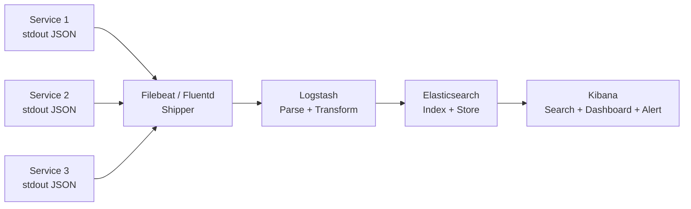
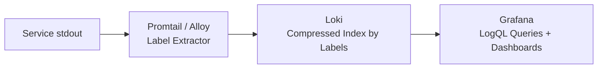
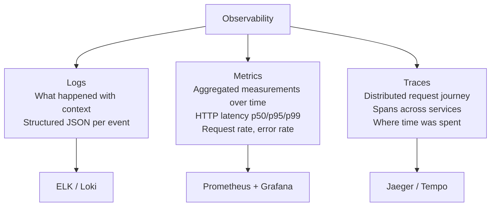

# Structured Logging and Observability

**Related:** [Error Handling](../error-handling/README.md) | [System Design](../../09-system-design.md)

---

## Structured vs Unstructured Logging

### Unstructured (do not do this in production)

```
[2026-01-15 14:32:01] ERROR: Failed to process payment for user john@example.com, amount $99.99
```

This is a string. To find all payment failures over a dollar amount, you write a regex. You cannot filter it. You cannot aggregate it. You cannot join it with other logs from the same request.

### Structured (JSON)

```json
{
  "level": "error",
  "time": "2026-01-15T14:32:01.234Z",
  "requestId": "req_01H8X9K2P3",
  "userId": "usr_7x2p9q",
  "operation": "processPayment",
  "amountCents": 9999,
  "currency": "USD",
  "durationMs": 342,
  "err": {
    "message": "Card declined",
    "code": "card_declined",
    "stack": "Error: Card declined\n  at PaymentService..."
  },
  "msg": "Payment processing failed"
}
```

Every field is queryable. Filter by `operation = processPayment AND amountCents > 5000`. Count errors by `userId`. Alert on `level = error AND operation = processPayment`. Build a dashboard. Structured logs are data.

---

## Log Levels

Use levels consistently. Each level has a specific meaning — misusing them trains engineers to ignore them.

| Level | When to use | Example |
|-------|-------------|---------|
| **ERROR** | Needs immediate attention. Something failed that a human must look at. | Payment failed, auth service unreachable, database query failed |
| **WARN** | Something unexpected happened but was handled. Worth knowing, not paging. | Retry succeeded on second attempt, cache miss for critical key, deprecated API called |
| **INFO** | State transitions and external calls. What happened at a high level. | User logged in, order placed, email sent, service started |
| **DEBUG** | Development only. Never in production — too verbose, too much PII risk. | SQL query text, full request body, internal state dumps |

```typescript
import pino from "pino";

const logger = pino({
  level: process.env.LOG_LEVEL ?? (process.env.NODE_ENV === "production" ? "info" : "debug"),
});

// ERROR: alert on this
logger.error({ err, requestId, userId }, "Payment failed — requires investigation");

// WARN: track in dashboard, do not page
logger.warn({ attempt, requestId }, "External API call failed, retrying");

// INFO: normal operation visibility
logger.info({ userId, orderId, amountCents }, "Order placed successfully");

// DEBUG: local dev only
logger.debug({ query, params }, "Executing SQL query");
```

---

## What to Log and What Not to Log

### Always Log

- Request ID (every log line)
- User ID (as opaque identifier, not name/email)
- Operation name
- Duration for external calls
- Outcome (success / failure / partial)
- Error details on failure (message, code, stack)

### Never Log

```typescript
// NEVER: credentials
logger.info({ password: input.password }, "Login attempt");

// NEVER: tokens (treat as passwords)
logger.debug({ accessToken: token }, "Issuing token");

// NEVER: PII (name, email, phone, address, IP in some jurisdictions)
logger.info({ email: user.email, name: user.name }, "User registered");

// NEVER: payment card data
logger.debug({ cardNumber: card.number }, "Processing card");

// CORRECT: log opaque identifiers only
logger.info({ userId: user.id, requestId }, "User registered");
logger.info({ orderId: order.id, amountCents: order.total, requestId }, "Payment initiated");
```

If your logs are ingested into ELK, Splunk, or CloudWatch — they persist for months, are searchable by many engineers, and may be part of regulatory audits. A single log line with a user's email or a token can create a compliance violation and a security incident simultaneously.

---

## Pino: The Right Logger for Node.js

`pino` is the fastest Node.js logging library by a significant margin. Two reasons:

1. **Minimal serialization overhead** — it builds JSON strings with minimal allocation
2. **Worker thread I/O** — log output is piped to a worker thread (via `pino.transport`), so disk/network I/O does not block the main event loop

```typescript
import pino from "pino";

const logger = pino(
  {
    level: process.env.LOG_LEVEL ?? "info",
    // Rename default fields to match your log aggregator's expected field names
    timestamp: pino.stdTimeFunctions.isoTime,
    formatters: {
      level(label) {
        return { level: label }; // "info" not 10
      },
    },
    // Redact sensitive fields before they hit the output
    redact: {
      paths: ["req.headers.authorization", "*.password", "*.token", "*.secret"],
      censor: "[REDACTED]",
    },
  },
  // In production, pipe to a transport (file, stdout for collector to pick up)
  process.env.NODE_ENV === "production"
    ? process.stdout
    : pino.transport({ target: "pino-pretty" }) // Human-readable in dev
);

export { logger };
```

### Child Loggers for Request Context

```typescript
// In request middleware — creates a child logger with requestId bound
app.use((req, res, next) => {
  const requestId = req.headers["x-request-id"] ?? crypto.randomUUID();
  req.log = logger.child({ requestId });
  next();
});

// In a route handler — requestId is automatically included
app.get("/users/:id", async (req, res) => {
  req.log.info({ userId: req.params.id }, "Fetching user");
  // All subsequent calls to req.log include requestId
});
```

---

## Correlation / Trace IDs

A trace ID follows a request through your entire system — from the HTTP handler through service calls through database queries and into logs. Without it, debugging a production issue means correlating logs from three services by timestamp, which is fragile and slow.

### Generating IDs at the Entry Point

```typescript
import crypto from "crypto";

// Middleware: generate or propagate trace ID
app.use((req, res, next) => {
  // Respect incoming trace ID from gateway or upstream service
  const traceId =
    (req.headers["x-trace-id"] as string) ??
    (req.headers["traceparent"] as string)?.split("-")[1] ?? // W3C TraceContext
    crypto.randomUUID();

  req.traceId = traceId;
  // Echo it back so clients can report it when filing a bug
  res.setHeader("x-trace-id", traceId);
  next();
});
```

### AsyncLocalStorage: Pass Context Without Threading Arguments

In Node.js, there is no thread-local storage. The traditional solution is passing `requestId` as a parameter through every function call. `AsyncLocalStorage` stores data that follows the async execution chain — any code awaited within the same request can read it without explicit threading.

```typescript
import { AsyncLocalStorage } from "async_hooks";

interface RequestContext {
  traceId: string;
  userId?: string;
  requestId: string;
}

const requestContext = new AsyncLocalStorage<RequestContext>();

// Middleware: populate the store
app.use((req, res, next) => {
  const context: RequestContext = {
    traceId: req.headers["x-trace-id"] as string ?? crypto.randomUUID(),
    requestId: crypto.randomUUID(),
  };

  // All code running within this callback and its async chain can access the store
  requestContext.run(context, next);
});

// Utility to get current context from anywhere in the call stack
export function getCurrentContext(): RequestContext {
  const ctx = requestContext.getStore();
  if (!ctx) throw new Error("Called outside of request context");
  return ctx;
}

// A service deep in the call stack — no need to accept requestId parameter
export async function sendEmail(to: string, template: string): Promise<void> {
  const { traceId } = getCurrentContext();
  logger.info({ traceId, template }, "Sending email");
  // ...
}
```

---

## Log Aggregation

### ELK Stack



**Elasticsearch** indexes logs for full-text search and field queries. At high volume, it is expensive (storage, compute, licensing for X-Pack features).

### Grafana Loki



Loki indexes only **labels** (e.g., `service=payment`, `env=production`, `level=error`) and stores log content compressed without indexing. Querying requires specifying labels, then filtering content with regex. Far cheaper than Elasticsearch at scale; queries over unindexed fields are slower.

**When to use Loki:** Cost is a constraint, you have good label discipline, you already use Grafana for metrics.
**When to use ELK:** Full-text search over arbitrary fields, complex aggregations, audit log use cases.

### CloudWatch Logs

AWS-managed, zero infrastructure overhead. Log groups → Log streams. Use **Insights** for SQL-like queries. Expensive at volume; use S3 export + Athena for long-term retention.

---

## The Three Pillars of Observability



| Pillar | Question answered | Tool examples |
|--------|------------------|---------------|
| **Logs** | What happened in a specific request? | Pino + ELK, Loki |
| **Metrics** | Is the system healthy right now? What is p99 latency? | Prometheus, Datadog, CloudWatch Metrics |
| **Traces** | Which service caused this slow request? Where did the 3 seconds go? | Jaeger, Zipkin, Tempo, Datadog APM |

Logs alone are not enough for distributed systems. A 2-second request might be slow because of a bad database query, a slow external API, or lock contention. A trace shows you the exact span where time was spent.

---

## W3C TraceContext Header

The W3C Trace Context specification defines the `traceparent` header for propagating trace context across HTTP calls between services. This allows distributed tracing systems to link spans from different services into a single trace.

```
traceparent: 00-4bf92f3577b34da6a3ce929d0e0e4736-00f067aa0ba902b7-01
              ^  ^                                ^               ^
              |  trace-id (16 bytes hex)          parent-span-id  flags
              version
```

```typescript
// Outgoing HTTP call — propagate trace context
async function callUserService(userId: string, ctx: RequestContext): Promise<User> {
  const response = await fetch(`${USER_SERVICE_URL}/users/${userId}`, {
    headers: {
      traceparent: `00-${ctx.traceId}-${ctx.spanId}-01`,
      "x-request-id": ctx.requestId,
    },
  });
  return response.json();
}
```

---

## OpenTelemetry SDK

OpenTelemetry is the vendor-neutral standard for generating traces, metrics, and logs. Instrument once; export to Jaeger, Datadog, Tempo, or any OTLP-compatible backend.

```typescript
import { NodeSDK } from "@opentelemetry/sdk-node";
import { OTLPTraceExporter } from "@opentelemetry/exporter-trace-otlp-http";
import { getNodeAutoInstrumentations } from "@opentelemetry/auto-instrumentations-node";

// Initialize once at process startup — before importing anything else
const sdk = new NodeSDK({
  traceExporter: new OTLPTraceExporter({
    url: process.env.OTEL_EXPORTER_OTLP_ENDPOINT,
  }),
  instrumentations: [
    getNodeAutoInstrumentations(), // Auto-instruments http, express, pg, redis, etc.
  ],
});

sdk.start();
```

```typescript
import { trace, SpanStatusCode } from "@opentelemetry/api";

const tracer = trace.getTracer("payment-service");

async function processPayment(orderId: string, amount: number): Promise<void> {
  // Create a span for this operation
  return tracer.startActiveSpan("payment.process", async (span) => {
    span.setAttributes({
      "order.id": orderId,
      "payment.amount_cents": amount,
    });

    try {
      await chargeCard(orderId, amount);
      span.setStatus({ code: SpanStatusCode.OK });
    } catch (err) {
      span.setStatus({ code: SpanStatusCode.ERROR, message: (err as Error).message });
      span.recordException(err as Error);
      throw err;
    } finally {
      span.end();
    }
  });
}
```

---

## Sentry for Error Tracking

Sentry is distinct from logging — it captures exceptions, groups them by fingerprint, tracks release regressions, and provides breadcrumbs (a trail of events leading to the error).

```typescript
import * as Sentry from "@sentry/node";

Sentry.init({
  dsn: process.env.SENTRY_DSN,
  environment: process.env.NODE_ENV,
  release: process.env.GIT_SHA,  // Links errors to specific deploys
  tracesSampleRate: 0.1,         // Sample 10% of transactions for performance monitoring
  beforeSend(event) {
    // Strip PII before sending to Sentry's servers
    if (event.user) {
      delete event.user.email;
      delete event.user.username;
    }
    return event;
  },
});

// Capture exceptions with context
try {
  await processOrder(orderId);
} catch (err) {
  Sentry.withScope((scope) => {
    scope.setTag("order.id", orderId);
    scope.setUser({ id: userId }); // ID only, no email
    Sentry.captureException(err);
  });
  throw err;
}
```

**Sentry vs logs:** Logs are for operational visibility — stream of events, queryable, retained for compliance. Sentry is for developer productivity — grouped errors, assignment workflow, alert on new error types introduced in a release. Use both.

---

## Complete Request Logging Middleware

```typescript
import pino from "pino";
import { AsyncLocalStorage } from "async_hooks";
import type { Request, Response, NextFunction } from "express";

const logger = pino({ level: "info" });
const requestStore = new AsyncLocalStorage<{ requestId: string; traceId: string }>();

export function requestLoggingMiddleware(req: Request, res: Response, next: NextFunction) {
  const requestId = crypto.randomUUID();
  const traceId = (req.headers["traceparent"] as string)?.split("-")[1] ?? requestId;
  const startTime = Date.now();

  res.setHeader("x-request-id", requestId);

  requestStore.run({ requestId, traceId }, () => {
    // Log the incoming request
    logger.info({
      requestId,
      traceId,
      method: req.method,
      path: req.path,
      // Do not log: req.body (may contain passwords), req.headers.authorization
    }, "Request received");

    // Log on completion
    res.on("finish", () => {
      const durationMs = Date.now() - startTime;
      const level = res.statusCode >= 500 ? "error" : res.statusCode >= 400 ? "warn" : "info";

      logger[level]({
        requestId,
        traceId,
        method: req.method,
        path: req.path,
        statusCode: res.statusCode,
        durationMs,
      }, "Request completed");
    });

    next();
  });
}

// Available anywhere in the async chain
export function getRequestContext() {
  return requestStore.getStore();
}
```

---

## Interview Q&A

**Q: Why use structured logging instead of plain text log messages?**

Structured logs are data — they can be indexed, filtered, aggregated, and alerted on. When an incident happens at 3am, you need to answer questions like "how many users were affected?", "which endpoint is failing?", "did this start after the 2pm deploy?". With plain text logs, answering those questions requires writing regex and grep pipelines. With structured JSON logs in ELK or Loki, they are single queries. Structured logging is not about aesthetics — it is about operational capability.

---

**Q: What is AsyncLocalStorage and why do you use it for logging in Node.js?**

`AsyncLocalStorage` from the Node.js `async_hooks` module stores data that propagates through the async execution chain. When you call `storage.run(data, callback)`, all code executed within that callback — including awaited promises, setTimeout callbacks, and everything they call — can access the stored data via `storage.getStore()`.

For logging, this means you set the `requestId` and `traceId` once in an HTTP middleware and every function deeper in the call stack can include them in log lines without receiving them as parameters. The alternative is threading `requestId` through every function signature, which pollutes every API in your codebase with an operational concern.

---

**Q: What are the three pillars of observability and what question does each answer?**

Logs answer "what happened in a specific request?" — they give you timestamped, contextualized events with rich detail. They are the debugging tool.

Metrics answer "is the system healthy right now?" — they are aggregated, numerical, time-series data. HTTP error rate, request throughput, p99 latency, queue depth. They are the alerting tool.

Traces answer "where did the time go in this distributed request?" — they follow a single request across service boundaries, showing a waterfall of spans. They tell you that a 3-second request spent 2.7 seconds waiting on a database query in the user service. They are the performance investigation tool.

In practice, an incident workflow is: metrics alert you there is a problem, traces show you where in the distributed system the problem is, logs show you the exact error with full context.

---

**Q: What should you never log, and why?**

Never log passwords, authentication tokens, API keys, or secrets — they are equivalent to credentials in plaintext. Never log PII: email addresses, full names, phone numbers, IP addresses (in some GDPR jurisdictions), credit card numbers, or Social Security numbers.

The reason is that logs are stored and retained for months, searched by many engineers, potentially ingested into third-party systems (Datadog, Splunk), and may be subject to security audits or legal discovery. A password in a log line is as dangerous as a password in a config file committed to git — it persists long after the event, in multiple places, accessible to many people.

Use opaque identifiers instead: log `userId: "usr_7x2p9q"` not `email: "user@example.com"`. If your user service needs to be involved in a support case, look up the email from the user ID internally.
