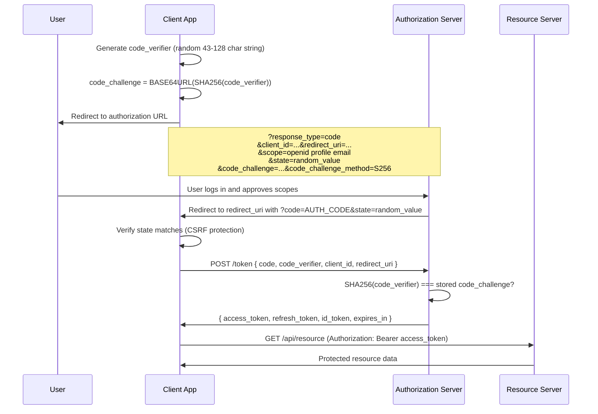
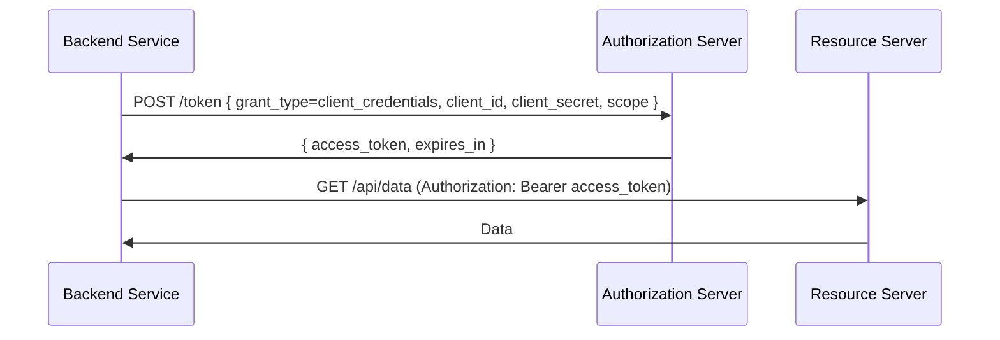
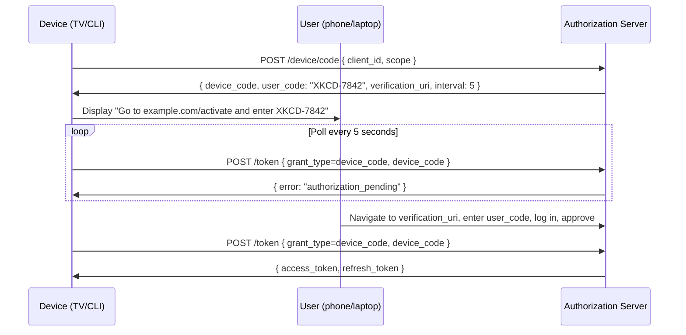

# OAuth 2.0 and OpenID Connect

**Related:** [Authentication](../authentication/README.md) | [JWT](../jwt/README.md) | [Sessions](../sessions/README.md)

---

## The Problem OAuth Solves

Before OAuth, "login with Google" meant giving your Google password to a third-party app. The app would then have full access to your account — and if it was compromised, so was your Google account.

OAuth 2.0 is a **delegated authorization framework**. It lets a user grant a third-party application limited access to their account on another service, without sharing credentials.

The key insight: **authorization, not authentication**. OAuth answers "what can this app do on your behalf?" — not "who are you?"

```
Without OAuth:                    With OAuth:
┌──────────┐                      ┌──────────┐
│  User    │ gives password to    │  User    │ authorizes limited access
│          │──────────────────►   │          │──────────────────────────►
└──────────┘ third-party app      └──────────┘ third-party app
                                       │
                                       │ gets access token (scoped)
                                       ▼
                                  ┌──────────┐
                                  │ Resource │
                                  │  Server  │
                                  └──────────┘
```

---

## Core Terminology

| Term | Definition |
|------|-----------|
| **Resource Owner** | The user who owns the data |
| **Client** | The third-party application requesting access |
| **Authorization Server** | Issues tokens (e.g., Google's OAuth server) |
| **Resource Server** | Holds the protected data (e.g., Google Drive API) |
| **Access Token** | Short-lived credential for resource access |
| **Refresh Token** | Long-lived credential to get new access tokens |
| **Scope** | What access the token grants |

---

## Grant Types

### 1. Authorization Code + PKCE (the standard for web and mobile apps)

The most secure flow. The client never sees the user's credentials. PKCE (Proof Key for Code Exchange) extends it for public clients.

#### Flow Diagram



#### What is PKCE?

PKCE (Proof Key for Code Exchange, pronounced "pixie") prevents **authorization code interception attacks**.

**The attack without PKCE:**
1. Malicious app on mobile device registers the same redirect URI scheme (e.g., `myapp://callback`)
2. When the authorization code is delivered to that URI, the malicious app intercepts it
3. Malicious app exchanges the code for tokens

**How PKCE prevents it:**
The client generates a secret (`code_verifier`) before the request and sends a hash of it (`code_challenge`) with the authorization request. When exchanging the code for tokens, the client proves it has the secret by sending `code_verifier`. The authorization server verifies `SHA256(code_verifier) === code_challenge`. An interceptor has the code but not the verifier — it cannot complete the exchange.

```typescript
import crypto from "crypto";

function generatePKCE(): { verifier: string; challenge: string } {
  const verifier = crypto.randomBytes(32).toString("base64url");
  const challenge = crypto
    .createHash("sha256")
    .update(verifier)
    .digest("base64url");
  return { verifier, challenge };
}
```

---

### 2. Client Credentials (machine-to-machine)

No user involved. A backend service authenticates directly with the authorization server using its own credentials.

**When to use:** Service-to-service API calls, background jobs, microservices talking to each other.



```typescript
async function getServiceToken(
  tokenUrl: string,
  clientId: string,
  clientSecret: string,
  scope: string
): Promise<string> {
  const response = await fetch(tokenUrl, {
    method: "POST",
    headers: { "Content-Type": "application/x-www-form-urlencoded" },
    body: new URLSearchParams({
      grant_type: "client_credentials",
      client_id: clientId,
      client_secret: clientSecret,
      scope,
    }),
  });

  if (!response.ok) {
    throw new Error(`Token request failed: ${response.status}`);
  }

  const data = await response.json();
  return data.access_token;
}
```

---

### 3. Device Authorization Flow (smart TVs, CLIs)

For devices with no browser or limited input capability. The device displays a short code; the user enters it on another device.



---

### 4. Refresh Token Grant

Access tokens are short-lived (typically 15 minutes to 1 hour). Refresh tokens let clients get new access tokens without re-involving the user.

```typescript
async function refreshAccessToken(
  tokenUrl: string,
  clientId: string,
  refreshToken: string
): Promise<{ accessToken: string; newRefreshToken?: string }> {
  const response = await fetch(tokenUrl, {
    method: "POST",
    headers: { "Content-Type": "application/x-www-form-urlencoded" },
    body: new URLSearchParams({
      grant_type: "refresh_token",
      refresh_token: refreshToken,
      client_id: clientId,
    }),
  });

  if (!response.ok) {
    // Refresh token is expired or revoked — user must log in again
    throw new Error("Refresh token invalid");
  }

  const data = await response.json();
  return {
    accessToken: data.access_token,
    // Some servers rotate refresh tokens — always store the newest one
    newRefreshToken: data.refresh_token,
  };
}
```

---

## Token Types

### Access Token

- Short-lived (15 min–1 hour typical)
- Sent with every API request in `Authorization: Bearer <token>`
- Resource servers validate it on each request
- Can be opaque (a reference) or a JWT (self-contained)
- **Do not store in localStorage** (XSS risk); prefer `httpOnly` cookies for web apps or in-memory for SPAs

### Refresh Token

- Long-lived (days to months)
- Only sent to the authorization server (never the resource server)
- Stored securely — if leaked, an attacker can get new access tokens
- Should be rotated on each use (authorization server issues a new one)
- Can be revoked server-side (unlike JWTs)

### ID Token (OpenID Connect only)

- A JWT containing **user identity claims**, not authorization
- Consumed by the **client**, not sent to resource servers
- Contains: `sub` (user ID), `iss` (issuer), `aud` (audience = your client_id), `iat`, `exp`, plus profile claims if scoped

```typescript
interface IdTokenPayload {
  sub: string;        // Unique user identifier
  iss: string;        // Issuer URL
  aud: string;        // Your client_id
  exp: number;        // Expiration timestamp
  iat: number;        // Issued at timestamp
  email?: string;     // If "email" scope was requested
  name?: string;      // If "profile" scope was requested
  picture?: string;
}
```

---

## Scopes

Scopes are space-separated strings that define what access the client is requesting.

| Scope | Meaning |
|-------|---------|
| `openid` | Required for OIDC — tells the AS to return an ID token |
| `profile` | User's name, picture, locale, etc. |
| `email` | User's email address and `email_verified` flag |
| `offline_access` | Include a refresh token in the response |
| Custom (e.g., `read:contacts`) | App-defined, validated by your resource server |

**Principle of least privilege:** Request only the scopes you need. Users see the scope list during authorization — a long list reduces conversion.

---

## OpenID Connect (OIDC)

OAuth 2.0 is an **authorization** framework. OpenID Connect is an **identity layer** built on top of it.

```
OAuth 2.0                   OpenID Connect
──────────────────────────  ──────────────────────────────────────
"Can this app read your      "Who are you?" + "Can this app read
 calendar?"                  your calendar?"
Returns: access token        Returns: access token + ID token
```

### What OIDC adds

1. **ID Token** — a JWT with user identity claims (validated by the client)
2. **UserInfo Endpoint** — `GET /userinfo` with `Authorization: Bearer <access_token>` returns fresh user claims
3. **Discovery Document** — `GET /.well-known/openid-configuration` returns the server's capabilities: endpoint URLs, supported grant types, supported scopes, public key URLs (`jwks_uri`)

```typescript
// Fetch discovery document to know where all endpoints are
async function discoverOIDCConfig(issuerUrl: string) {
  const response = await fetch(
    `${issuerUrl}/.well-known/openid-configuration`
  );
  return response.json() as Promise<{
    issuer: string;
    authorization_endpoint: string;
    token_endpoint: string;
    userinfo_endpoint: string;
    jwks_uri: string;
    scopes_supported: string[];
    grant_types_supported: string[];
  }>;
}
```

### Validating an ID Token

```typescript
import { createRemoteJWKSet, jwtVerify } from "jose";

async function validateIdToken(idToken: string, issuer: string, clientId: string) {
  const oidcConfig = await discoverOIDCConfig(issuer);
  const JWKS = createRemoteJWKSet(new URL(oidcConfig.jwks_uri));

  const { payload } = await jwtVerify(idToken, JWKS, {
    issuer,
    audience: clientId,  // Must match your client_id exactly
  });

  return payload;
}
```

---

## Security Mistakes and How to Avoid Them

### Open Redirect via Missing State Validation

**Problem:** The `state` parameter is optional in spec but critical for CSRF protection. Without it, an attacker can trick a user into completing an authorization flow that the attacker initiated, binding the attacker's code to the victim's session.

**Fix:** Always generate a cryptographically random `state`, store it in the session, and verify it matches when the callback arrives before exchanging the code.

```typescript
// Before redirecting to authorization server:
const state = crypto.randomBytes(16).toString("hex");
session.oauthState = state;

// In callback handler:
if (req.query.state !== session.oauthState) {
  throw new Error("State mismatch — possible CSRF attack");
}
delete session.oauthState;
```

### Token Leakage via Implicit Flow

The older Implicit flow returned tokens in the URL fragment (`#access_token=...`). Browsers log URLs, tokens appear in referrer headers, and browser history stores them.

**Fix:** Never use Implicit flow. Use Authorization Code + PKCE. The code in the redirect is one-use and short-lived; tokens never appear in URLs.

### Not Validating `aud` (Audience) Claim

If your resource server accepts any JWT from your authorization server without checking `aud`, an attacker with a token issued for a different client can access your API.

**Fix:** Always verify `aud === your_resource_server_identifier` in resource server token validation.

### Storing Refresh Tokens Insecurely

Refresh tokens are as sensitive as passwords. Storing them in `localStorage` exposes them to XSS. Storing them in a non-`httpOnly` cookie does the same.

**Fix:** Store refresh tokens in `httpOnly`, `Secure`, `SameSite=Strict` cookies. For mobile, use the platform secure keychain/keystore.

---

## Full TypeScript Example: Authorization Code + PKCE

```typescript
import crypto from "crypto";
import express from "express";

const app = express();

const OAUTH_CONFIG = {
  clientId: process.env.OAUTH_CLIENT_ID!,
  redirectUri: "http://localhost:3000/callback",
  authorizationEndpoint: "https://accounts.google.com/o/oauth2/v2/auth",
  tokenEndpoint: "https://oauth2.googleapis.com/token",
  scopes: ["openid", "profile", "email"],
};

// In-memory state store — use Redis in production
const pendingStates = new Map<string, { codeVerifier: string; expiresAt: number }>();

// Step 1: Initiate authorization
app.get("/login", (req, res) => {
  const state = crypto.randomBytes(16).toString("base64url");
  const codeVerifier = crypto.randomBytes(32).toString("base64url");
  const codeChallenge = crypto
    .createHash("sha256")
    .update(codeVerifier)
    .digest("base64url");

  // Store verifier keyed by state — expires in 10 minutes
  pendingStates.set(state, {
    codeVerifier,
    expiresAt: Date.now() + 10 * 60 * 1000,
  });

  const params = new URLSearchParams({
    response_type: "code",
    client_id: OAUTH_CONFIG.clientId,
    redirect_uri: OAUTH_CONFIG.redirectUri,
    scope: OAUTH_CONFIG.scopes.join(" "),
    state,
    code_challenge: codeChallenge,
    code_challenge_method: "S256",
  });

  res.redirect(`${OAUTH_CONFIG.authorizationEndpoint}?${params}`);
});

// Step 2: Handle the callback
app.get("/callback", async (req, res) => {
  const { code, state, error } = req.query as Record<string, string>;

  if (error) {
    res.status(400).send(`Authorization failed: ${error}`);
    return;
  }

  if (!state || !code) {
    res.status(400).send("Missing state or code");
    return;
  }

  const pending = pendingStates.get(state);
  if (!pending || pending.expiresAt < Date.now()) {
    res.status(400).send("Invalid or expired state");
    return;
  }

  pendingStates.delete(state);

  try {
    const tokenResponse = await fetch(OAUTH_CONFIG.tokenEndpoint, {
      method: "POST",
      headers: { "Content-Type": "application/x-www-form-urlencoded" },
      body: new URLSearchParams({
        grant_type: "authorization_code",
        code,
        redirect_uri: OAUTH_CONFIG.redirectUri,
        client_id: OAUTH_CONFIG.clientId,
        code_verifier: pending.codeVerifier,
      }),
    });

    if (!tokenResponse.ok) {
      const err = await tokenResponse.text();
      throw new Error(`Token exchange failed: ${err}`);
    }

    const tokens = await tokenResponse.json();

    // tokens.access_token — use for API calls
    // tokens.refresh_token — store securely
    // tokens.id_token — parse for user identity

    res.json({ message: "Logged in", expiresIn: tokens.expires_in });
  } catch (err) {
    res.status(500).send("Token exchange failed");
  }
});

app.listen(3000);
```

---

## OAuth 2.0 vs SAML

| Dimension | OAuth 2.0 / OIDC | SAML 2.0 |
|-----------|-----------------|----------|
| Format | JSON / JWT | XML |
| Era | Modern (2012+) | Enterprise (2005+) |
| Use case | Consumer apps, mobile, APIs | Enterprise SSO, legacy systems |
| Complexity | Lower | High (XML signing, large spec) |
| Mobile support | Native | Poor (designed for browsers) |
| Token | JWT (compact) | XML assertions (verbose) |
| When to choose | New systems, APIs, mobile | Connecting to enterprise IdPs (Active Directory Federation Services) |

---

## Interview Q&A

**Q: Explain OAuth 2.0 to a junior developer.**

OAuth is a way to let users grant apps limited access to their accounts on other services, without giving those apps their passwords. Imagine a food delivery app that wants to access your Google contacts to find friends. Instead of asking for your Google password, it redirects you to Google, you approve the specific access (contacts only), and Google gives the delivery app a token that only works for contacts. The app never sees your password, and you can revoke the token anytime without changing your password.

---

**Q: When do you use Client Credentials vs Authorization Code flow?**

Client Credentials is for machine-to-machine communication where there is no user involved — a background job, a microservice calling another microservice, a cron task hitting an API. There is no browser redirect, no user consent screen, just a backend service authenticating with its own identity.

Authorization Code (+ PKCE) is for when a user needs to delegate access to an application. The user is present, a browser redirect happens, the user sees a consent screen. The authorization server issues tokens on behalf of that specific user.

Rule of thumb: if you can answer "which user authorized this?", use Authorization Code. If the answer is "no user, just a service", use Client Credentials.

---

**Q: What does PKCE protect against, and why did we need it?**

PKCE protects against authorization code interception. On mobile devices, multiple apps can register the same URL scheme. When the authorization server redirects back with the code, a malicious app could intercept that redirect and receive the code before the legitimate app does. Without PKCE, the malicious app could exchange that code for tokens.

PKCE breaks this by requiring the legitimate client to prove knowledge of a secret it generated before the flow started. The malicious app can intercept the code but cannot complete the exchange because it does not have the `code_verifier`.

PKCE was originally designed for mobile apps (where there is no client secret), but the recommendation now is to use PKCE for all Authorization Code flows, including confidential web server clients, as defense in depth.

---

**Q: What is the difference between OAuth and OpenID Connect?**

OAuth 2.0 is an authorization framework — it answers "what can this app do?" and issues access tokens. It does not define what those tokens look like or how to get user identity from them.

OpenID Connect is an identity layer on top of OAuth 2.0 — it answers "who are you?" by adding the ID token (a JWT with user claims), the UserInfo endpoint, and the discovery document. OIDC standardizes how applications perform user authentication using OAuth infrastructure.

Practically: if you want to let users log in ("Sign in with Google"), you need OIDC. If you want an app to call the Google Calendar API on a user's behalf without caring who they are, OAuth alone is enough. Most real systems use both together.

---

**Q: Why should the Implicit flow never be used?**

The Implicit flow returns access tokens directly in the URL fragment after the authorization redirect. URL fragments end up in browser history, server logs (if the fragment is ever sent as a query param by accident), and referrer headers. A token in a URL is a leaked token.

Additionally, Implicit flow was designed before PKCE existed, to work around the problem of public clients not having client secrets. PKCE solves the same problem more securely without putting tokens in URLs.

All major identity providers have deprecated or removed support for Implicit flow. Use Authorization Code + PKCE.
