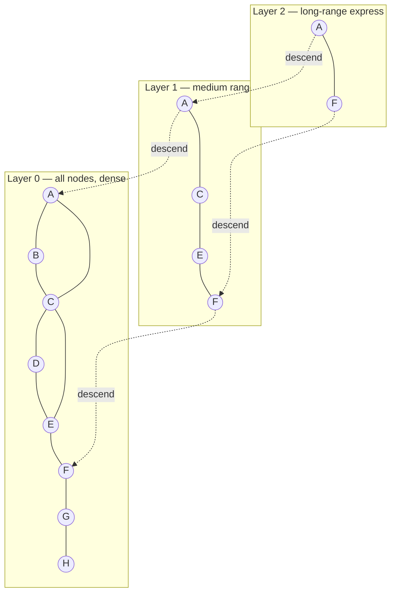

# Similarity Search

## Why Exact Nearest Neighbor Search Is Infeasible

Given a query vector and a corpus of N vectors each with D dimensions, exact nearest neighbor search requires computing the distance between the query and every vector in the corpus. That is O(N × D) operations per query.

At production scale this breaks down:

- **1M vectors × 1,536 dimensions (text-embedding-3-small)** = 6 GB RAM just for the float32 index
- **10M vectors** = 60 GB — exceeds a single server's working memory
- **Latency**: scanning 1M 1536-dim vectors takes ~50–200ms in CPU-optimized code; for user-facing search, 10ms is the threshold for perceived responsiveness

The exact solution does not scale. The field of **Approximate Nearest Neighbor (ANN)** search solves this by trading a small, controlled amount of recall for orders-of-magnitude improvements in latency and memory.

---

## ANN Overview: The Core Tradeoff

ANN algorithms return the *approximate* k nearest neighbors — the true nearest neighbors with high probability, but not guaranteed. The key parameters in any ANN algorithm control the **recall-latency-memory triangle**:

- **Recall** — what fraction of the true nearest neighbors appear in the returned results (recall@10 = 95% means 9.5 of the true top-10 are returned on average)
- **Latency** — how long a single query takes
- **Memory** — RAM required to hold the index

You cannot simultaneously maximize all three. Every algorithm forces a tradeoff.

---

## HNSW: Hierarchical Navigable Small World

HNSW is the dominant algorithm in production vector databases (Weaviate, Qdrant, pgvector all use it as the default index). It achieves O(log N) query time with high recall.

### Data Structure

HNSW builds a multi-layer graph. Each layer is a "navigable small world" graph — a network where any node can reach any other node in O(log N) hops.

```
Layer 2 (sparse): [A] ──────────────── [F]
                   |                    |
Layer 1 (medium): [A] ── [C] ─── [E] ─ [F]
                   |     |       |      |
Layer 0 (dense):  [A][B][C][D][E][F][G][H]  ← all nodes
```

- **Layer 0** contains all vectors with connections to their nearest neighbors.
- **Higher layers** contain exponentially fewer nodes and serve as "express lanes" for long-distance navigation.
- A node's layer assignment is random with an exponential decay: most nodes are only in layer 0, a few appear in layer 1, fewer still in layer 2, etc.

### Insertion

When inserting a new node:
1. Randomly assign it a maximum layer (most get layer 0).
2. Start at the top layer, greedily navigate to the nearest neighbor.
3. Descend to the next layer from that point.
4. Repeat until layer 0.
5. At each layer where the node is present, add bidirectional links to its M nearest neighbors found during traversal.

### Query

```
query → enter at top layer, find nearest neighbor
      → descend with that neighbor as entry point
      → repeat through each layer
      → at layer 0, expand neighborhood using ef_search candidates
      → return top-k from candidates
```

### Key Parameters

| Parameter | What It Controls | Typical Range |
|-----------|-----------------|---------------|
| `M` | Edges per node per layer. Higher = better recall, more memory, slower build | 8–48 |
| `ef_construction` | Candidate pool size during build. Higher = better graph quality, slower insert | 100–500 |
| `ef_search` | Candidate pool size at query time. Higher = better recall, higher latency | 50–200 |

`ef_search` is adjustable at query time — you can tune it per-request without rebuilding the index.

**Memory footprint**: HNSW stores the full vectors plus the graph structure. For 1M 1536-dim float32 vectors: ~6 GB for vectors + ~1-2 GB for graph = ~8 GB total.

---

## IVF: Inverted File Index

IVF partitions the vector space using k-means clustering and restricts search to the most promising clusters.

### Build Phase

1. Run k-means on the entire corpus with `nlist` centroids (e.g., 1,024 or 4,096).
2. Assign each vector to its nearest centroid.
3. Build an inverted index: centroid → list of vector IDs.

### Query Phase

1. Embed the query.
2. Find the `nprobe` nearest centroids (e.g., 10 out of 1,024).
3. Search only the vectors assigned to those centroids.
4. Return the top-k from the searched subset.

### The nprobe Tradeoff

`nprobe` is the primary knob:

- `nprobe = 1`: very fast, poor recall (misses any neighbors not in the nearest centroid)
- `nprobe = nlist`: exact search — defeats the purpose
- `nprobe = 10` with `nlist = 1024`: search ~1% of the corpus, ~85–90% recall in practice

The optimal `nprobe` depends on your data distribution and recall requirements. You tune it empirically by measuring recall against a ground-truth dataset.

**Memory footprint**: IVF stores the full vectors in the inverted lists plus centroid vectors. Comparable to HNSW for vectors, but no graph overhead.

---

## Product Quantization: Billion-Scale Compression

Product Quantization (PQ) compresses vectors to a fraction of their original size, enabling billion-scale search on a single machine.

### How It Works

1. **Split** each D-dimensional vector into M subvectors of D/M dimensions.
2. For each subspace, train a separate k-means codebook with K centroids (K = 256 is common).
3. **Encode** each subvector as the ID of its nearest centroid in that subspace (1 byte if K=256).

```
1536-dim vector → split into 96 subvectors of 16-dim each
                → each subvector → 1-byte centroid ID
                → 96 bytes total (vs. 6,144 bytes for float32)
```

That is a **64x compression ratio**. The tradeoff is lossy: you are approximating the original vector, which reduces recall compared to exact vectors.

**IVF + PQ** is the standard combination for billion-scale search:
- IVF narrows the search to a subset of clusters
- PQ compresses the vectors within those clusters for fast approximate distance computation

FAISS implements this as `IndexIVFPQ`.

---

## Distance Metrics in Depth

The choice of distance metric must match how the embedding model was trained.

### Cosine Similarity

```
cosine(u, v) = (u · v) / (‖u‖ × ‖v‖)
```

Measures the angle between vectors. Invariant to magnitude — a short and long vector pointing in the same direction have cosine similarity = 1.

**Use when**: comparing semantic content regardless of vector magnitude. Standard for text embeddings when you care about meaning, not scale.

**Tip**: if all vectors are L2-normalized (‖v‖ = 1), then cosine similarity equals dot product. Most embedding APIs return normalized vectors; confirm before assuming.

### Dot Product

```
dot(u, v) = u · v = Σ(u_i × v_i)
```

Cosine similarity times the product of magnitudes. Magnitude-sensitive: a vector that points in the right direction but has larger magnitude scores higher.

**Use when**: the embedding model was trained with dot product as the similarity objective (e.g., recommendation systems where popularity is encoded in magnitude). Do not use for text embeddings trained with cosine loss — you will get wrong results.

### L2 / Euclidean Distance

```
L2(u, v) = √(Σ(u_i - v_i)²)
```

Measures geometric distance. Sensitive to both angle and magnitude.

**Use when**: the model was trained with L2 distance (e.g., some image embeddings, dense retrieval models trained with in-batch negatives using L2). Generally not recommended for general-purpose text embeddings.

### Which to Use for OpenAI / Anthropic Embeddings

OpenAI's `text-embedding-3-*` and Anthropic's embeddings are trained for **cosine similarity**. The vectors are returned normalized, so cosine similarity equals dot product — use either; most vector databases default to cosine.

---

## Recall@k: Evaluating ANN Quality

Recall@k measures what fraction of the true k nearest neighbors appear in the ANN's top-k results.

```
Recall@10 = |ANN top-10 ∩ Exact top-10| / 10
```

To measure it: run exact NN on a sample, run your ANN index on the same sample, compare.

Industry targets:
- **High-quality production**: recall@10 ≥ 0.95
- **Acceptable with faster latency**: recall@10 ≥ 0.90
- **Speed-critical, bulk use cases**: recall@10 ≥ 0.80

For RAG systems, the downstream LLM can partially compensate for imperfect recall — missing one relevant chunk out of 10 is often recoverable. Target ≥ 0.90.

---

## The Recall-Latency-Memory Triangle

No algorithm wins on all three axes simultaneously:

| Algorithm | Recall | Latency | Memory | Best Use Case |
|-----------|--------|---------|--------|---------------|
| Exact (brute force) | 1.00 | High | Moderate | <100K vectors, offline |
| HNSW | 0.95–0.99 | Very low | High (graph overhead) | <100M vectors, low latency required |
| IVF (flat) | 0.85–0.95 | Low | Moderate | 1M–100M vectors |
| IVF + PQ | 0.75–0.90 | Very low | Very low | 100M–10B vectors |
| ScaNN (Google) | 0.95+ | Low | Moderate | Google-scale, specialized hardware |

---

## HNSW Architecture Diagram



Query traversal: enter at layer 2, greedy-navigate to nearest node, descend through layers, expand search at layer 0 with `ef_search` candidate pool.

---

## FAISS: Production ANN Library

FAISS (Facebook AI Similarity Search) is the reference implementation for production ANN. It supports CPU and GPU, all major index types, and is the engine behind many vector databases.

```python
import faiss
import numpy as np

d = 1536  # embedding dimension
n = 100_000  # number of vectors

# Build HNSW index
index = faiss.IndexHNSWFlat(d, 32)  # M=32
index.hnsw.efConstruction = 200
index.hnsw.efSearch = 64

# Add vectors
vectors = np.random.random((n, d)).astype('float32')
index.add(vectors)

# Query
query = np.random.random((1, d)).astype('float32')
distances, indices = index.search(query, k=10)

print(indices)    # top-10 neighbor IDs
print(distances)  # L2 distances (use IndexHNSWFlat with normalized vectors for cosine)
```

```python
# IVF + PQ for billion-scale (64x compression)
nlist = 1024   # number of clusters
M_pq = 96     # number of PQ subvectors (d must be divisible by M_pq)
nbits = 8     # bits per subvector centroid (2^8 = 256 centroids)

quantizer = faiss.IndexFlatL2(d)
index = faiss.IndexIVFPQ(quantizer, d, nlist, M_pq, nbits)

index.train(vectors)   # required for IVF — k-means training
index.add(vectors)

index.nprobe = 10  # search 10 nearest clusters
distances, indices = index.search(query, k=10)
```

---

## Interview Q&A

**Q: Why can't we just scan all vectors for every query?**
A: Linear scan is O(N × D). At 1M vectors with 1536 dimensions, that is ~1.5 billion float multiplications per query. At 10ms per query this just barely works, but at 10M vectors or 1,000 queries/second it collapses. ANN algorithms reduce this to O(log N) or O(nprobe × cluster_size) with >90% recall.

**Q: Explain HNSW to a non-expert.**
A: Imagine a map with three zoom levels. At the highest zoom (layer 2) you see only major cities and can jump between them quickly. At the lowest zoom (layer 0) you see every address. To find the nearest pizza place to your hotel: zoom out to find the right neighborhood, zoom in to find the exact block, walk the block to find the closest one. HNSW does the same thing with vectors — it navigates coarsely at first, then refines.

**Q: What is the difference between cosine similarity and dot product? When do you use each?**
A: Cosine similarity is the normalized dot product — it measures angle only, ignoring vector magnitude. Dot product is magnitude-sensitive. Use cosine for text embeddings trained with cosine objectives (OpenAI, Cohere, most general-purpose models). Use dot product for models trained with dot product objectives, such as recommendation systems that encode item popularity in magnitude. If vectors are already L2-normalized, the two are equivalent.

**Q: What is recall@k and why does it matter for RAG?**
A: Recall@k is the fraction of true nearest neighbors that appear in the approximate results. For a RAG system, if the answer requires chunk X and your retriever returns 10 chunks, recall@10 tells you the probability chunk X was included. Below ~90% recall, you start missing relevant context often enough that answer quality degrades measurably.

**Q: How does Product Quantization achieve 64x compression?**
A: PQ splits a 1536-dim float32 vector (6,144 bytes) into 96 subvectors of 16 dimensions each. Each subvector is replaced by the index of its nearest centroid from a 256-entry codebook — one byte. 96 bytes total vs. 6,144 bytes original. The approximation is lossy but good enough for retrieval purposes, and the speed and memory savings are enormous.

---

## Related Topics

- [Vector Databases](../vector-databases/README.md) — which databases use which ANN algorithms
- [AI/ML Fundamentals](../fundamentals/README.md) — embeddings and vector spaces
- [Advanced RAG](../../06-rag/advanced-rag/README.md) — hybrid search and reranking
