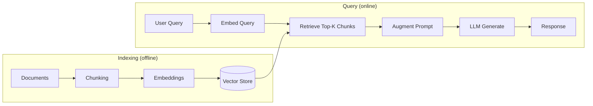

# Basic RAG — Retrieval-Augmented Generation

## 1. The Problem Statement — Why LLMs Need External Knowledge

Large language models are trained on a static snapshot of text. That training data has a cutoff date, and it covers the public internet — not your private documents, internal knowledge bases, recent events, or proprietary data. This creates three concrete failure modes:

**Staleness.** Ask a model about something that changed after its training cutoff and it confidently gives outdated information. No amount of prompting fixes this because the knowledge literally does not exist in the model's weights.

**Missing private context.** Your company's internal documentation, customer support tickets, product specs, and code repositories were never in the training data. The model cannot answer questions about them.

**Hallucination under pressure.** When a model does not know something, it often generates plausible-sounding but fabricated text rather than admitting ignorance. This is worse than a simple "I don't know" because the error is invisible unless the reader already knows the answer.

RAG solves all three by retrieving relevant text at inference time and injecting it into the prompt as context. The model is not asked to recall facts from memory — it is asked to read a provided excerpt and answer based on that excerpt. This shifts the knowledge burden from model weights to an external, updatable knowledge store.

The tradeoff is latency and infrastructure cost: every query now involves a retrieval step before the LLM call. For most production use cases this is worth it.

---

## 2. Architecture



The pipeline has two distinct phases:

- **Indexing** happens once (or on a schedule). Documents are processed, split, embedded, and stored. This is the offline batch pipeline.
- **Query** happens on every user request. The query is embedded, relevant chunks are retrieved, the prompt is assembled, and the LLM generates a response.

---

## 3. Each Step Explained

### Documents

The starting point is raw content: PDF files, HTML pages, Markdown documents, database records, code files, transcripts. Documents vary wildly in length and structure. A single PDF might be 200 pages; a support ticket might be three sentences. Both can participate in the same RAG system, but they need different handling strategies downstream.

The key attributes to track for each document:
- A stable identifier (URL, file path, database ID)
- Metadata: source, author, date, document type, tags
- The raw text content

Metadata is not just bookkeeping — it becomes a retrieval filter. "Find chunks from documents published in the last 30 days" requires that date metadata to be stored alongside the embedding.

### Chunking

Documents are too long to embed and retrieve as a unit. A 50-page PDF, embedded whole, produces a single vector that represents the average meaning of the entire document — it matches queries about anything in the document weakly and nothing specifically. Chunking breaks documents into semantically meaningful units that can be individually retrieved.

The goal is chunks that are:
- **Self-contained enough** to answer a question on their own when injected into a prompt
- **Small enough** that a retrieved chunk is dense with relevant information rather than diluted by unrelated content
- **Large enough** that a single chunk provides sufficient context — not a sentence fragment

Chunking is covered in depth in [../chunking-strategies/README.md](../chunking-strategies/README.md).

### Embeddings

Each chunk is passed through an embedding model to produce a dense vector — typically 768 to 3072 floating-point numbers — that encodes the semantic meaning of the text. Chunks about similar topics end up near each other in this high-dimensional space; chunks about different topics end up far apart.

Embedding models are separate from the generative LLM. Common choices:
- `text-embedding-3-small` / `text-embedding-3-large` (OpenAI)
- `embed-english-v3.0` (Cohere)
- `all-mpnet-base-v2` and other sentence-transformers models (open source)
- Proprietary embedding endpoints from the same provider as your LLM

The embedding model must remain fixed. If you switch embedding models, all existing embeddings become invalid — the new model's vector space is incompatible, and similarity comparisons across old and new embeddings are meaningless.

### Vector Store

Embeddings are stored in a vector database alongside the chunk text and metadata. The vector store's job is to answer nearest-neighbor queries: "given this query vector, return the K most similar stored vectors."

Common vector stores:
- **Pinecone** — managed, production-grade, strong filtering
- **Weaviate** — open source, supports hybrid search natively
- **Qdrant** — open source, Rust-based, fast
- **ChromaDB** — lightweight, good for development and small-scale production
- **pgvector** — PostgreSQL extension, good if you already run Postgres and want to avoid a separate service
- **FAISS** — Facebook's library, fast but no persistence; runs in-process

For many production workloads, pgvector is the pragmatic choice — it eliminates operational complexity and enables SQL joins between vector search results and relational data.

### Query Embedding

At query time, the user's question is passed through the same embedding model used during indexing. This is not optional — using a different model produces a vector in an incompatible space, and similarity scores will be random noise.

### Retrieve Top-K

The query vector is compared against all stored chunk vectors using a similarity metric. Cosine similarity is standard for text embeddings. The K most similar chunks are returned.

K is a hyperparameter. Common values are 3 to 10. Higher K means more context but larger prompts and more noise. Lower K means tighter context but higher risk of missing the relevant chunk.

Approximate nearest-neighbor (ANN) search (HNSW, IVF) makes retrieval fast even over millions of vectors by trading a small accuracy loss for large speed gains. Exact search is only practical at small scale.

### Augment Prompt

Retrieved chunks are assembled into the prompt. The structure matters — see Section 4 for the template.

At this stage you also decide:
- Whether to de-duplicate chunks (same text appearing twice)
- Whether to re-rank chunks by relevance before injecting (see advanced-rag for reranking)
- Whether to include chunk metadata (source, date) in the prompt

### Generate

The assembled prompt is sent to the LLM. The model's instructions tell it to base its answer on the provided context and to decline if the context does not support an answer. The LLM does not need to retrieve — it only needs to read and synthesize the text it has been given.

---

## 4. The RAG Prompt Template

How context is injected into the prompt significantly affects output quality. The key principles:

- Clearly delimit the context from the question
- Instruct the model to answer from the context, not from memory
- Instruct the model to say when it does not know rather than guessing
- Optionally include source attribution instructions

```
You are a helpful assistant. Answer the user's question using ONLY the information
provided in the context sections below. If the context does not contain enough
information to answer the question, say so — do not use prior knowledge or make
up information.

When relevant, cite the source of your answer in brackets, e.g. [Source: <source_id>].

---

CONTEXT:

[CHUNK 1]
Source: internal-docs/onboarding.md
Date: 2024-11-15

New employees must complete the security training module within their first two weeks.
The training takes approximately 3 hours and covers data handling policies...

[CHUNK 2]
Source: internal-docs/hr-policy.md
Date: 2024-10-01

Vacation accrual begins on the employee's first day of employment. Full-time employees
accrue 1.5 days per month for the first two years...

[CHUNK 3]
Source: internal-docs/benefits.md
Date: 2024-11-01

The health insurance enrollment window opens 30 days before your start date if
you are hired with a pre-arranged start date...

---

QUESTION: {{user_question}}

ANSWER:
```

Key decisions in this template:

**Delimiter style.** Use explicit section headers (`[CHUNK 1]`, `---`) rather than just concatenating chunks. This helps the model treat each chunk as a distinct source rather than one long stream of text.

**Source metadata in context.** Including the source file and date allows the model to reason about recency ("the 2024-10-01 policy says X") and to provide citations.

**Instruction placement.** Put the grounding instructions in the system prompt or before the context, not after. Instructions buried after 3000 tokens of retrieved text are less reliably followed.

**Explicit fallback instruction.** Tell the model what to do when context is insufficient. Without this, the model defaults to using its parametric knowledge, which undermines the whole point of RAG.

---

## 5. Common Failure Modes

### Bad Retrieval

The retrieved chunks do not contain the information needed to answer the question. This is the most common failure mode and it has several causes:

**Semantic mismatch.** The user's question uses different vocabulary than the document. "How do I reset my password?" might not retrieve a document titled "Account Credential Recovery Procedures" despite being semantically equivalent. Solutions: query rewriting, synonym expansion, hybrid search (see advanced-rag).

**Chunk boundary problems.** The answer spans two chunks and only one is retrieved. A question about "the maximum loan amount for first-time buyers" might retrieve a chunk containing the definition of "first-time buyer" and miss the chunk containing the actual limit. Solutions: larger chunks, overlapping chunks, parent-child chunking.

**Wrong K.** The relevant chunk is ranked 11th and K is set to 10. Solutions: higher K (with reranking to manage noise), or better indexing.

**Stale index.** The document was updated but the embeddings were not re-generated. Solutions: incremental indexing on document change, TTL-based re-indexing.

**Query too short or ambiguous.** Single-word or highly ambiguous queries produce poor embeddings. "How?" has no meaningful embedding. Solutions: minimum query length validation, query rewriting.

### Hallucination Despite Context

The model ignores the provided context and answers from its parametric memory anyway. This happens when:

- The context is long and the relevant information is buried in the middle (the "lost in the middle" effect)
- The model's parametric knowledge contradicts the context and it defaults to what it "knows"
- The instructions to stay grounded are weak or absent

Solutions: stronger system prompt instructions, shorter and more focused context windows, retrieval that returns fewer but higher-quality chunks, position the most relevant chunk first in the context.

### Context Overflow

The retrieved chunks plus the question plus the system prompt exceed the model's context window. The request fails or the model truncates the context.

Solutions: measure token counts before constructing the prompt; lower K; use smaller chunks; use a model with a larger context window; implement a summarization step for long retrieved passages.

Related: even when the total fits, stuffing a 100K token context with 50 retrieved chunks makes the model's attention diffuse. Quality often degrades before you hit the hard limit. Aim to keep the injected context to a few thousand tokens unless you have specific reasons to go longer.

### Irrelevant but Plausible Retrieval

The top-K chunks are not actually relevant to the question but score well on embedding similarity because they share surface vocabulary. The model then constructs an answer using those irrelevant chunks, producing a confident but wrong response.

Solutions: higher retrieval threshold (filter by minimum similarity score, not just top-K count), reranking with a cross-encoder, hybrid search to add keyword signal.
