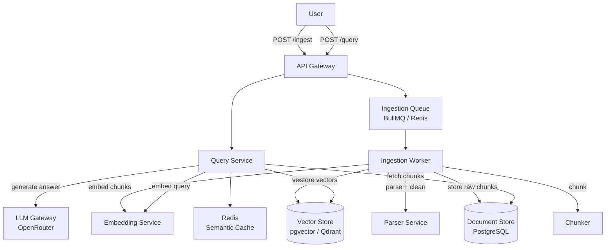

# System Design: Production RAG Platform

## Requirements

**Functional**
- Ingest documents (PDF, DOCX, URLs, plain text)
- Query the knowledge base with natural language
- Return grounded answers with source citations
- Support multiple tenants (isolated knowledge bases)

**Non-functional**
- Query latency < 3s end-to-end (p95)
- Ingestion is async (not blocking the user)
- 99.9% availability for query path
- Tenant isolation — tenant A cannot retrieve tenant B's documents

---

## Architecture



---

## Ingestion Pipeline

```
Raw Document
    ↓
Parse (PDF→text, DOCX→text, HTML→text)
    ↓
Clean (remove boilerplate, fix encoding, normalize whitespace)
    ↓
Chunk (RecursiveCharacterSplitter: 500 chars, 50 overlap)
    ↓
Attach Metadata (tenant_id, source_url, page_number, chunk_index, created_at)
    ↓
Embed (batch: embed 50 chunks per API call)
    ↓
Store chunks in PostgreSQL (with chunk text + metadata)
Store vectors in pgvector (with chunk_id foreign key)
```

Ingestion is always async. The API returns `{ jobId }` immediately. The user polls `/jobs/:id` or receives a webhook.

---

## Data Model

```sql
-- Document registry
CREATE TABLE documents (
  id         UUID PRIMARY KEY DEFAULT gen_random_uuid(),
  tenant_id  UUID NOT NULL REFERENCES tenants(id),
  title      TEXT,
  source_url TEXT,
  status     TEXT DEFAULT 'pending',  -- pending, processing, ready, failed
  created_at TIMESTAMPTZ DEFAULT NOW()
);

-- Chunks (source of truth for retrieved text)
CREATE TABLE chunks (
  id          UUID PRIMARY KEY DEFAULT gen_random_uuid(),
  document_id UUID NOT NULL REFERENCES documents(id) ON DELETE CASCADE,
  tenant_id   UUID NOT NULL,
  content     TEXT NOT NULL,
  chunk_index INTEGER,
  metadata    JSONB DEFAULT '{}'
);

-- Vectors (pgvector)
CREATE TABLE chunk_embeddings (
  chunk_id  UUID PRIMARY KEY REFERENCES chunks(id) ON DELETE CASCADE,
  tenant_id UUID NOT NULL,
  embedding VECTOR(1536)  -- text-embedding-3-small dimension
);

CREATE INDEX ON chunk_embeddings
  USING hnsw (embedding vector_cosine_ops)
  WITH (m = 16, ef_construction = 64);
```

---

## Query Flow

```
1. Receive query + tenant_id

2. Check semantic cache (Redis)
   - Key: hash(tenant_id + normalized_query)
   - TTL: 1 hour
   → HIT: return cached answer + citations

3. Embed the query (same model as ingestion!)

4. Vector search (tenant-scoped):
   SELECT chunk_id, 1 - (embedding <=> $query_vector) AS score
   FROM chunk_embeddings
   WHERE tenant_id = $tenant_id
   ORDER BY embedding <=> $query_vector
   LIMIT 20;

5. Fetch top-k chunks (k=6 after reranking):
   SELECT content, metadata FROM chunks WHERE id IN (...)

6. (Optional) Rerank: cross-encoder to re-score retrieved chunks
   → keep top 6

7. Build prompt:
   SYSTEM: "Answer using ONLY the context below. Cite [Doc N] for each claim."
   CONTEXT: [Doc 1] chunk1... [Doc 2] chunk2...
   USER: <question>

8. Call LLM (via OpenRouter for model flexibility)

9. Parse response + extract citations

10. Cache result in Redis

11. Return { answer, citations: [{ docId, chunkIndex, text }] }
```

---

## Tenant Isolation

Always filter by `tenant_id` at every query. Use PostgreSQL Row Level Security (RLS) as a backstop:

```sql
ALTER TABLE chunks ENABLE ROW LEVEL SECURITY;
CREATE POLICY tenant_isolation ON chunks
  USING (tenant_id = current_setting('app.current_tenant')::uuid);
```

Set `app.current_tenant` at the start of every transaction:
```sql
SET LOCAL app.current_tenant = '<tenant_id>';
```

---

## Scaling Bottlenecks

| Bottleneck | Signal | Solution |
|-----------|--------|---------|
| Embedding API latency | Ingestion slow | Batch embeds, cache embeddings of common queries |
| Vector search latency | p95 > 500ms | Tune HNSW `ef_search`, add read replicas |
| LLM latency | 2-5s per call | Stream response, parallel reranking, semantic cache |
| Ingestion backpressure | Queue grows | Scale workers, increase BullMQ concurrency |

---

## Evaluation

Track these metrics per release:
- **Retrieval recall@k**: % of relevant chunks in top-k results
- **Answer faithfulness**: does the answer only use retrieved context? (RAGAS)
- **Answer relevancy**: does the answer address the question?
- **Latency**: p50, p95, p99 for query end-to-end
