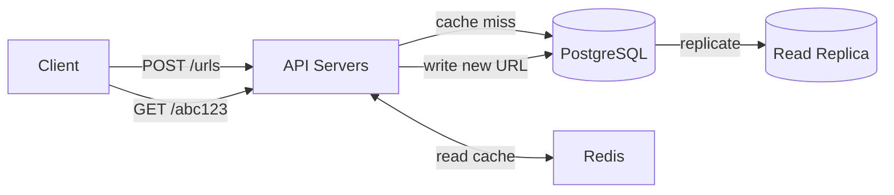

# System Design: URL Shortener

## Requirements

**Functional**
- Given a long URL, return a short URL (e.g. `sho.rt/abc123`)
- Redirect short URL to the original long URL
- Optional: custom aliases, expiry, analytics

**Non-functional**
- 100M URLs stored, 500M redirects/day
- Redirect latency < 10ms (p99)
- 99.99% availability (redirects must work even during writes being slow)
- Durable — a short URL must always resolve to the same long URL

---

## Estimation

- Redirects: 500M/day ≈ **6,000 req/s** (peak 2–3×: ~15,000 req/s)
- Writes: assume 1M new URLs/day ≈ **12 writes/s** — read-heavy 500:1
- Storage per URL: short_code(7B) + long_url(200B) + metadata(100B) ≈ 307B
- Total storage: 100M × 307B ≈ **30 GB** — fits comfortably in memory

---

## API Design

```
POST /urls
Body: { "longUrl": "https://...", "alias"?: "custom", "expiresAt"?: "ISO date" }
Response: { "shortUrl": "https://sho.rt/abc123" }

GET /:code
Response: 301/302 redirect to longUrl
```

Use **301 (permanent)** for non-expiring URLs — browsers cache it (fewer hits to your servers).
Use **302 (temporary)** when you want every redirect to hit your servers (for analytics or expiring URLs).

---

## Short Code Generation

### Base62 encoding
Characters: `[a-z][A-Z][0-9]` = 62 characters.
7 characters = 62^7 ≈ 3.5 trillion possible codes. More than enough.

**Option 1: Increment a counter, encode in base62**
```
ID 1     → "0000001"
ID 125   → "000002B"
```
Predictable, no collisions, easily reversible. Weakness: enumerable (attackers can scan all URLs).

**Option 2: Random 7-char base62 string**
```typescript
function generateCode(): string {
  const chars = 'abcdefghijklmnopqrstuvwxyzABCDEFGHIJKLMNOPQRSTUVWXYZ0123456789'
  return Array.from({ length: 7 }, () =>
    chars[Math.floor(Math.random() * chars.length)]
  ).join('')
}
```
Check for collision before insert. With 100M stored out of 3.5T possible, collision probability is ~0.003% per attempt.

**Option 3: Hash the long URL (MD5, first 7 chars)**
Deterministic — same URL always gets same code. Problem: two users shortening the same URL get the same code (may or may not be desired).

---

## Architecture



---

## Data Model

```sql
CREATE TABLE urls (
  id          BIGSERIAL PRIMARY KEY,
  short_code  CHAR(7) UNIQUE NOT NULL,
  long_url    TEXT NOT NULL,
  user_id     UUID REFERENCES users(id),
  expires_at  TIMESTAMPTZ,
  created_at  TIMESTAMPTZ DEFAULT NOW()
);

CREATE INDEX idx_short_code ON urls (short_code);  -- lookup by short code
CREATE INDEX idx_user_id ON urls (user_id);         -- list user's URLs
```

---

## Redirect Flow

```
1. Client hits GET /abc123
2. Check Redis: GET redirect:abc123
   → HIT: 302 redirect, done (< 1ms)
   → MISS: query PostgreSQL WHERE short_code = 'abc123'
3. Store in Redis: SET redirect:abc123 <longUrl> EX 86400
4. 302 redirect to long URL
```

Cache hit rate target: 99%+ (hot codes served entirely from Redis).
Redis memory: 30GB of data × 0.1% cold factor = most of hot data fits in a few GB of RAM.

---

## Analytics (Optional)

Don't log every redirect synchronously (adds latency). Instead:

```
Redirect happens → publish event to Kafka/Redis Stream
                → consumer batch-writes to analytics DB (ClickHouse/TimescaleDB)
```

Analytics writes are non-blocking and don't affect redirect latency.

---

## Scaling

- **Redirect path**: stateless API servers behind ALB, horizontal scale
- **Cache layer**: Redis Cluster, replicated
- **Database**: PostgreSQL with read replicas for redirects (writes go to primary, reads from replica)
- **Custom domains**: route custom domains to the same API (SNI SSL termination at load balancer)

---

## Failure Modes

| Failure | Impact | Mitigation |
|---------|--------|-----------|
| Redis down | All redirects hit DB | Circuit breaker; Redis Sentinel/Cluster |
| DB primary down | Writes fail | Failover replica to primary (< 30s with Patroni) |
| API server down | LB routes around it | Health checks, min 3 instances |
| Short code collision | Insert fails | Retry with new code (at most 2-3 retries) |
