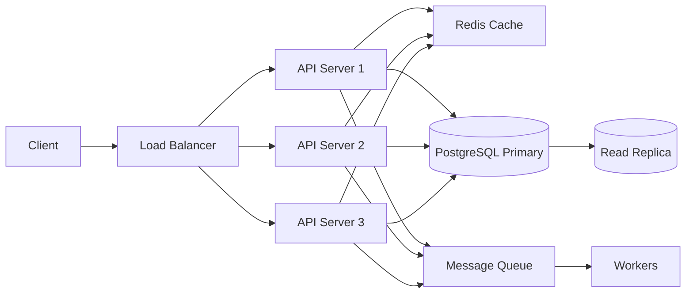

# System Design Fundamentals

## Interview Framework

Use this sequence for every system design question:

### 1. Clarify Requirements (5 min)
Functional: what must the system do?
Non-functional: scale, latency, availability, consistency, durability.

Always ask: read/write ratio, expected QPS, data size, geographic distribution.

### 2. Estimation (3 min)
Back-of-envelope: storage needed, QPS, bandwidth. Shows you can reason about scale.

### 3. High-Level Architecture (5 min)
Draw the boxes: clients, load balancer, services, databases, caches, queues. Don't go deep yet.

### 4. API Design (5 min)
Define the key endpoints. Show you understand the product requirements.

### 5. Data Model (5 min)
Schema design. Primary keys, indexes, relationships.

### 6. Deep Dive (15 min)
Go deep on the hard parts — whichever the interviewer cares about most.

### 7. Bottlenecks and Tradeoffs (5 min)
What breaks first at scale? What did you trade off?

---

## Numbers Every Engineer Should Know

| Operation | Latency |
|-----------|---------|
| L1 cache reference | 0.5 ns |
| L2 cache reference | 7 ns |
| RAM read | 100 ns |
| SSD read | 150 µs |
| Network round trip (same DC) | 0.5 ms |
| Network round trip (cross-region) | 150 ms |
| HDD seek | 10 ms |
| Send 1KB over 1Gbps | 10 µs |

| Scale | Magnitude |
|-------|-----------|
| 1 million requests/day | ~12 req/s |
| 1 billion requests/day | ~11,500 req/s |
| 1 TB | 1,000 GB |
| 1 PB | 1,000 TB |

---

## CAP Theorem

In a distributed system, during a **network partition** you must choose between:

**Consistency** — every read receives the most recent write (or an error).
**Availability** — every request receives a response (may not be the latest data).

You cannot have both during a partition.

| System | Choice | Example |
|--------|--------|---------|
| PostgreSQL (single node) | CA — no partition tolerance | Traditional RDBMS |
| Cassandra | AP | Eventually consistent, always available |
| HBase | CP | Consistent but may reject requests during partition |
| DynamoDB | AP (tunable) | Default eventual, strong consistency optional |
| Redis Cluster | AP | Async replication, prefers availability |

Most systems choose **AP** because network partitions are rare but real — downtime during a partition is often unacceptable.

---

## Consistency Patterns

**Strong consistency**: read always returns the latest write. Achieved via synchronous replication or single-writer.
- Cost: higher latency (must wait for all replicas to acknowledge)

**Eventual consistency**: reads may return stale data but will eventually converge.
- Cost: must handle read-your-writes issues, conflict resolution

**Causal consistency**: operations that are causally related are seen in order. Middle ground.

---

## Back-of-Envelope Examples

### Twitter-scale (500M tweets/day)
- Write QPS: 500M / 86400 ≈ 6,000 writes/s
- Read QPS: assume 10:1 read/write → 60,000 reads/s
- Tweet size: 300 bytes avg
- Storage/day: 6,000 × 300B = 1.8 MB/s → ~155 GB/day → ~57 TB/year

### URL Shortener (100M URLs total)
- Storage: 100M × 500B avg = 50 GB (fits in RAM for hot data)
- Read QPS: 100M redirects/day = ~1,150 req/s
- Write QPS: assume 1M new URLs/day = ~12 writes/s (very write-light)

---

## Load Balancing Algorithms

| Algorithm | How It Works | Best For |
|-----------|-------------|---------|
| Round robin | Cycle through servers in order | Homogeneous servers, equal request cost |
| Weighted round robin | Like RR but heavier servers get more | Heterogeneous server capacity |
| Least connections | Route to server with fewest active connections | Long-lived connections, variable request cost |
| IP hash | Hash client IP to consistent server | Session persistence without sticky cookies |
| Random | Pick randomly | Simple, surprisingly effective |

---

## Stateless vs Stateful Services

**Stateless**: server holds no per-user state. Any instance can handle any request. Scale horizontally trivially.

**Stateful**: server holds session/connection state. Scaling requires routing the same user to the same server (sticky sessions) or externalizing state.

Design stateless whenever possible. Externalize state to Redis, a database, or a distributed cache.

---

