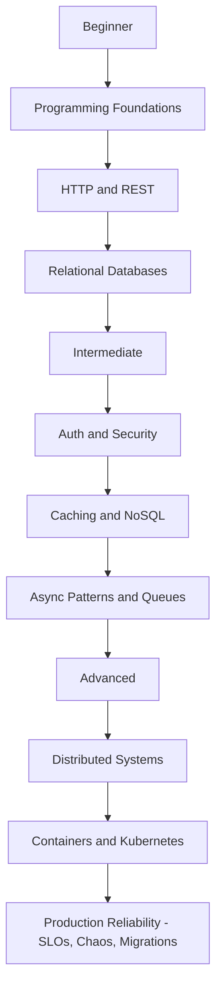
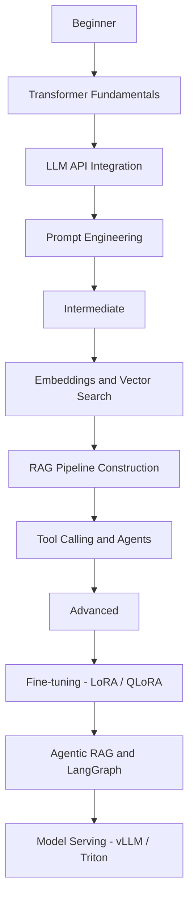
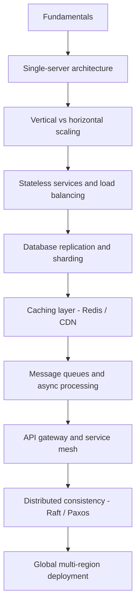

# Backend Preparation Audit

A structured reference for engineers preparing across backend systems, distributed systems, AI/ML/LLM pipelines, and system design — from first principles to production. Each section is self-contained and progressively deepens from foundational concepts to production-grade implementation, covering the breadth a senior engineer is expected to draw from during technical interviews and on the job.

---

## Folder Structure

| Section | Contents |
|---------|----------|
| `00-foundations` | Programming language runtimes, memory models, concurrency primitives, OSI model, TCP/IP fundamentals |
| `01-http` | HTTP/1.1, HTTP/2, HTTP/3, QUIC, REST API design, headers, caching, CORS, request lifecycle |
| `02-databases` | Relational (PostgreSQL), NoSQL (Redis, MongoDB, Cassandra), indexing, query planning, ACID, MVCC |
| `03-auth-security` | JWT, OAuth 2.0, OIDC, PKCE, session management, OWASP Top 10, TLS, secrets management |
| `04-distributed-systems` | CAP/PACELC, consistency models, Raft/Paxos, distributed transactions, saga and outbox patterns |
| `05-message-queues` | Kafka (partitions, consumer groups, exactly-once), RabbitMQ, SQS, event sourcing, CQRS |
| `06-system-design` | Scalability patterns, CDNs, load balancing, consistent hashing, rate limiting, common system walkthroughs |
| `07-observability` | Structured logging, distributed tracing (OpenTelemetry), metrics (Prometheus/Grafana), alerting |
| `08-containers-infra` | Docker (multi-stage builds, hardening), Kubernetes (pods, deployments, HPA, ingress), Terraform |
| `09-ai-ml-fundamentals` | Transformer architecture, tokenization, embeddings, loss functions, model evaluation, scikit-learn |
| `10-llm-engineering` | Prompt engineering, tool calling, structured output, fine-tuning (LoRA/QLoRA), guardrails, LLM observability |
| `11-rag-systems` | Document ingestion, chunking strategies, vector databases, hybrid search, retrieval evaluation, reranking |
| `12-agents` | LangGraph, ReAct, agentic RAG, multi-agent patterns, MCP protocol, tool orchestration |
| `13-model-serving` | vLLM, TGI, Triton, batching strategies, embedding services, cost optimization, A/B testing AI features |
| `14-dsa` | Arrays, hashing, stacks, binary search, trees, graphs, heaps, DP, backtracking, greedy, string algorithms |
| `15-interview-prep` | Behavioral questions (STAR format), system design interview templates, mock interview log, offer negotiation |

---

## Learning Roadmaps

### Backend Engineering Roadmap



**Beginner (Weeks 1-4)**
- Understand the HTTP request/response lifecycle end to end
- Build a REST API with proper error handling, validation, and middleware
- Write complex SQL queries: JOINs, window functions, CTEs, subqueries
- Understand ACID, isolation levels, and basic indexing

**Intermediate (Weeks 5-8)**
- Implement JWT auth and OAuth 2.0 authorization code flow with PKCE
- Add Redis caching with cache-aside and write-through strategies
- Set up Kafka producers and consumers with consumer groups
- Use Docker to containerize an application and run it in compose

**Advanced (Weeks 9-16)**
- Design systems that scale to 100K+ RPS with clear trade-off reasoning
- Deploy to Kubernetes with HPA, health checks, and rolling deployments
- Instrument services with OpenTelemetry traces, Prometheus metrics, and structured logs
- Define SLOs and build runbooks for incident response

---

### AI/ML and LLM Engineering Roadmap



**Beginner (Weeks 1-3)**
- Understand attention, positional encoding, and tokenization at a conceptual level
- Call an LLM API with system prompts, few-shot examples, and temperature control
- Stream responses with server-sent events and render them on a client

**Intermediate (Weeks 4-7)**
- Generate and store embeddings; run cosine similarity search
- Build a RAG pipeline: ingest documents, chunk them, retrieve, and generate cited answers
- Implement function/tool calling with multi-step agentic loops

**Advanced (Weeks 8-12)**
- Fine-tune a model with LoRA/QLoRA and evaluate on a held-out test set
- Build an agentic RAG system with query decomposition and self-correcting retrieval
- Serve a model with vLLM, configure batching, and monitor cost and latency

---

### DSA Progression Roadmap


Each node in the graph represents a pattern to master before advancing. Work 3-5 problems per pattern at the medium difficulty level before moving on.

---

### System Design Roadmap



**Fundamentals:** Single-server → database separation → load balancer → replication
**Intermediate:** Caching strategies, message queues, service decomposition, rate limiting
**Advanced:** Global distribution, multi-region failover, consistency/availability trade-offs, SLOs

---

## Technology Matrix

| Technology | Foundational | Intermediate | Advanced |
|---|---|---|---|
| HTTP/2 | Request/response model, status codes | Multiplexing, header compression (HPACK), server push | QUIC transport, HTTP/3 migration strategy |
| WebSockets | Upgrade handshake, message framing | Heartbeat, reconnection logic, backpressure | Horizontal scaling with sticky sessions or pub/sub fan-out |
| gRPC | Protobuf schema, unary RPCs | Streaming RPCs (server/client/bidirectional), interceptors | Deadlines, retries, load balancing with service mesh |
| JWT | Header/payload/signature structure, HS256 | RS256/ES256, refresh token rotation, token introspection | JWK rotation, short-lived tokens with revocation lists |
| OAuth 2.0 | Authorization code flow, access/refresh tokens | PKCE extension, client credentials, device flow | Token binding, DPoP, mTLS-bound tokens |
| PostgreSQL | CRUD, joins, basic indexes | Window functions, CTEs, EXPLAIN ANALYZE, B-tree index design | MVCC internals, partitioning, logical replication, vacuuming |
| Redis | String/list/hash/set/sorted set data types, TTL | Pub/sub, pipelining, Lua scripting, keyspace notifications | Redis Cluster sharding, persistence (RDB vs AOF), Redlock |
| MongoDB | Document CRUD, basic queries | Aggregation pipeline, compound indexes, replica sets | Sharding (hashed vs range), change streams, transactions |
| Vector DBs | Cosine similarity, embedding storage | HNSW and IVF indexing, metadata filtering, hybrid search | Index versioning, incremental updates, multi-tenant isolation |
| Kafka | Topics, partitions, producers, consumers | Consumer groups, offsets, compaction, exactly-once semantics | Kafka Streams, transactional producers, Kafka Connect |
| Docker | Dockerfile syntax, image layering | Multi-stage builds, non-root users, health checks | Image scanning, distroless images, BuildKit caching |
| Kubernetes | Pods, deployments, services | ConfigMaps, Secrets, HPA, liveness/readiness probes | Network policies, RBAC, custom controllers, Helm charts |
| Terraform | Resource definitions, providers | State management, modules, remote backends | Workspaces, drift detection, Terragrunt patterns |
| TypeScript | Types, interfaces, generics | Conditional types, mapped types, discriminated unions | Template literal types, variance, declaration merging |
| C++ | Pointers, RAII, STL containers | Smart pointers, move semantics, template basics | Concurrency (std::thread, atomics), SIMD, memory layout |
| PyTorch | Tensors, autograd, basic training loop | DataLoader, custom datasets, learning rate scheduling | Distributed training (DDP), quantization, ONNX export |
| LLM fine-tuning | Instruction fine-tuning concepts | LoRA, QLoRA, adapter layers, PEFT library | RLHF, DPO, full fine-tune on multi-GPU |
| Embeddings | What they represent, generation via API | Batch embedding, normalization, dimensionality | Embedding versioning, domain-specific fine-tuning |
| LangGraph | Node/edge graph definition, state | Conditional edges, human-in-the-loop, streaming | Multi-agent graphs, subgraphs, persistence layer |
| MCP | Protocol overview, tool definition schema | Server implementation, resource and prompt types | Multi-server orchestration, auth, sampling |
| vLLM | Basic inference server setup | PagedAttention, continuous batching, quantization | Multi-GPU serving, speculative decoding, prefix caching |
| OpenTelemetry | Traces, spans, propagation headers | Metrics, logs correlation, OTLP exporter | Collector pipeline, tail-based sampling, custom instrumentation |

---

## How to Use This Repo

### Setup

```bash
# Clone and set up
git clone <repo-url> backend-prep-audit
cd backend-prep-audit

# Python environment (for sections 09-13)
python3 -m venv .venv
source .venv/bin/activate
pip install -r requirements.txt

# Node/TypeScript environment (for sections 00-08, 14-15)
npm install

# C++ build (for section 14 C++ exercises)
mkdir -p 14-dsa/cpp/build
cd 14-dsa/cpp/build && cmake .. && make
```

### Internal Folder Convention

Each section folder follows this structure:

```
XX-section-name/
  notes.md          — concept notes, diagrams, and key takeaways
  exercises/        — coding exercises with starter files
  solutions/        — reference solutions (check only after attempting)
  resources.md      — curated reading list specific to this section
  checklist.md      — verifiable milestones for this section
```

### Recommended Workflows

**Interview preparation (8-12 weeks out):** Follow the 12-week plan in ROADMAP.md sequentially. Do not skip foundations — interviewers probe at the edges. Complete all milestones before moving to the next phase.

**Deep learning a specific topic:** Go directly to the relevant section. Read `notes.md`, work through `exercises/`, and verify your understanding against `checklist.md` before considering yourself done.

**Working reference during a project:** Use the technology matrix above to identify relevant sections. The `notes.md` files are written for scanning, not cover-to-cover reading.

### Running Test Harnesses

```bash
# TypeScript / JavaScript exercises
npm test -- --testPathPattern="14-dsa"

# Python exercises
pytest 09-ai-ml-fundamentals/ 10-llm-engineering/ 11-rag-systems/ -v

# C++ exercises (from build directory)
cd 14-dsa/cpp/build && ctest --output-on-failure
```

---

## Progress Checklist

### 00 — Foundations
- [ ] Can explain the difference between a process and a thread, and when to use each
- [ ] Can implement async/await correctly and explain the event loop in your primary language
- [ ] Can describe OSI layers 3, 4, and 7 with concrete protocol examples
- [ ] Can implement a basic TCP socket server and client from scratch
- [ ] Can explain the difference between concurrency and parallelism

### 01 — HTTP
- [ ] Can trace the full lifecycle from URL entry to page render, including DNS, TCP, and TLS
- [ ] Can explain how HTTP/2 multiplexing eliminates head-of-line blocking
- [ ] Can design a clean REST API with proper resource naming, versioning, and pagination
- [ ] Can configure CORS headers correctly for a cross-origin API
- [ ] Can implement and explain cache-control headers (max-age, no-store, stale-while-revalidate)

### 02 — Databases
- [ ] Can write complex queries using window functions, CTEs, and correlated subqueries without notes
- [ ] Can read and interpret EXPLAIN ANALYZE output to find and fix slow queries
- [ ] Can explain MVCC and how it enables non-blocking reads in PostgreSQL
- [ ] Can design a schema from scratch, justify normalization decisions, and identify denormalization opportunities
- [ ] Can configure Redis sorted sets to power a real-time leaderboard
- [ ] Can explain when to choose MongoDB over PostgreSQL and vice versa

### 03 — Auth and Security
- [ ] Can implement OAuth 2.0 authorization code flow with PKCE from scratch
- [ ] Can explain why JWTs cannot be invalidated without additional infrastructure and how to mitigate this
- [ ] Can identify and fix SQL injection, XSS, and CSRF vulnerabilities in a code sample
- [ ] Can implement bcrypt password hashing with correct work factor selection
- [ ] Can configure a Content Security Policy header that blocks inline scripts
- [ ] Can describe how SSRF attacks work and enumerate three server-side mitigations

### 04 — Distributed Systems
- [ ] Can explain CAP theorem and give a real database example for each trade-off region
- [ ] Can describe the Raft consensus algorithm at the level of leader election and log replication
- [ ] Can implement the saga pattern for a distributed transaction across two services
- [ ] Can explain the difference between strong, eventual, and causal consistency with examples

### 05 — Message Queues
- [ ] Can explain Kafka partitioning and how consumer groups achieve parallel consumption
- [ ] Can implement exactly-once semantics with Kafka transactional producers
- [ ] Can design an event sourcing system and explain how it differs from traditional CRUD
- [ ] Can choose between Kafka, RabbitMQ, and SQS given a set of requirements with justification
- [ ] Can implement the outbox pattern to avoid dual-write inconsistencies

### 06 — System Design
- [ ] Can design a URL shortener end to end in 45 minutes with trade-off discussion
- [ ] Can design a notification system with fan-out, deduplication, and delivery guarantees
- [ ] Can explain consistent hashing and how it minimizes key remapping on node addition/removal
- [ ] Can design a rate limiter using Redis with sliding window and token bucket variants
- [ ] Can complete a Twitter feed, YouTube, or Uber design in 45 minutes with clear component breakdown

### 07 — Observability
- [ ] Can instrument a service with OpenTelemetry traces and propagate context across HTTP and Kafka
- [ ] Can write Prometheus metric definitions (counter, gauge, histogram) and query them in PromQL
- [ ] Can correlate a log line, a trace span, and a metric spike to diagnose a production issue
- [ ] Can define SLIs and SLOs for a web service and calculate error budget burn rate

### 08 — Containers and Infrastructure
- [ ] Can write a multi-stage Dockerfile that produces a minimal production image
- [ ] Can configure a Kubernetes deployment with liveness probes, resource limits, and HPA
- [ ] Can write a Terraform module for a VPC, compute instance, and managed database
- [ ] Can implement a CI/CD pipeline with test parallelism and canary deployment strategy

### 09 — AI/ML Fundamentals
- [ ] Can explain the attention mechanism and why positional encoding is necessary
- [ ] Can train a simple classifier with scikit-learn, tune hyperparameters, and evaluate with precision/recall/F1
- [ ] Can explain the difference between underfitting and overfitting and apply regularization techniques
- [ ] Can generate embeddings for a document corpus and describe what the vector dimensions represent

### 10 — LLM Engineering
- [ ] Can implement chain-of-thought and few-shot prompting and measure impact on output quality
- [ ] Can build a tool-calling agent that calls external APIs and handles multi-turn tool results
- [ ] Can implement LoRA fine-tuning on a small model and evaluate on a held-out test set
- [ ] Can set up LangSmith tracing and build a latency/cost dashboard for LLM calls
- [ ] Can configure guardrails for PII detection and topic restriction on model inputs and outputs

### 11 — RAG Systems
- [ ] Can implement three chunking strategies and explain the accuracy/latency trade-offs of each
- [ ] Can build a full RAG pipeline: ingest PDFs, embed, store in a vector DB, retrieve, and generate
- [ ] Can implement hybrid search combining dense vector search with BM25 sparse retrieval
- [ ] Can evaluate a RAG pipeline with faithfulness and context recall using RAGAS
- [ ] Can implement HyDE (hypothetical document embeddings) and measure retrieval improvement

### 12 — Agents
- [ ] Can build a LangGraph agent with conditional edges and human-in-the-loop interruption
- [ ] Can implement a multi-step agentic RAG system with query decomposition
- [ ] Can define and serve an MCP server with tools, resources, and prompts
- [ ] Can explain the ReAct prompting pattern and implement it without a framework

### 13 — Model Serving
- [ ] Can deploy a model with vLLM and configure continuous batching and quantization
- [ ] Can design an embedding service with batch processing, caching, and versioned indexes
- [ ] Can set up an A/B test for an AI feature with meaningful evaluation metrics
- [ ] Can implement prompt compression and explain the latency/accuracy trade-off

### 14 — DSA
- [ ] Can solve sliding window, two-pointer, and prefix sum problems without hints
- [ ] Can implement binary search on sorted arrays and on answer space
- [ ] Can implement all tree traversals (pre/in/post-order, level-order, BFS) from memory
- [ ] Can implement Dijkstra's, BFS, DFS, and topological sort on an adjacency list from memory
- [ ] Can solve 0/1 knapsack, LCS, and LIS with both memoization and tabulation
- [ ] Can solve 2 medium LeetCode problems in under 35 minutes total under timed conditions

### 15 — Interview Prep
- [ ] Have prepared and rehearsed STAR-format answers for 10 behavioral questions
- [ ] Have completed 5+ timed mock coding interviews with verbal explanation
- [ ] Have completed 3+ full 45-minute system design mock sessions
- [ ] Can discuss trade-offs in any major architectural decision without prompting
- [ ] Have a prepared answer for "walk me through a technically challenging project"

---

## Quick-Reference Resources

| Section | Must-Read | Must-Watch | Primary Tool |
|---|---|---|---|
| HTTP | High Performance Browser Networking (hpbn.co) | Hussein Nasser — HTTP/2 Deep Dive | Wireshark |
| Databases | Designing Data-Intensive Applications — Kleppmann | CMU 15-445 lectures (Andy Pavlo) | psql + EXPLAIN |
| Auth | OAuth 2 in Action — Richer & Sanso | Aaron Parecki — OAuth 2.0 Simplified | JWT.io |
| Distributed Systems | DDIA chapters 5-9 | MIT 6.824 Distributed Systems lectures | Jepsen test reports |
| System Design | System Design Interview Vol 1 & 2 — Alex Xu | ByteByteGo YouTube channel | Excalidraw |
| LLM Engineering | Hands-On LLMs — Alammar & Grootendorst | Andrej Karpathy — Let's build GPT | LangSmith |
| RAG | LlamaIndex and LangChain docs | Jerry Liu — RAG from Scratch | RAGAS |
| DSA | Elements of Programming Interviews | NeetCode.io video solutions | LeetCode |
| Kubernetes | Kubernetes in Action — Luksa | TGI Kubernetes series | k9s |
| Observability | Distributed Systems Observability — Sridharan | OpenTelemetry docs walkthroughs | Jaeger / Grafana |

---

## Repository Conventions

**Language choice:** TypeScript for backend API exercises, Python for AI/ML/RAG exercises, C++ for performance-sensitive DSA problems where complexity analysis matters. SQL exercises use PostgreSQL syntax.

**Testing:** Every exercise should have a corresponding test file. TypeScript exercises use Jest, Python exercises use pytest, C++ exercises use Google Test. Run the full test suite before marking a section complete.

**Notes format:** `notes.md` files follow the pattern: concept definition, why it matters, how it works (mechanism), common misconceptions, and a worked example. Keep them scannable with headers and bullet points.

**Commit discipline:** Commit per exercise, not per section. Commit message format: `[section] short description of what was implemented`. Example: `[02-databases] add window function query exercises with solutions`.
